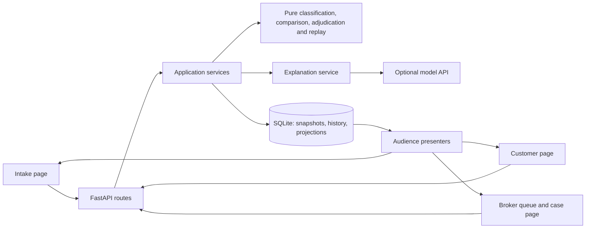

# Implementation plan: AI-augmented individual health insurance flow

Status: planning complete; implementation has not started.  
Prepared: 10 September 2026.  
Workspace: `C:\Users\rajut\OneDrive\Documents\ChatGPT\helm ai`.

## 1. Decision and scope

Build a small, persistent web application covering intake, classification, quotes, recommendation review, policy creation, all four servicing operations, and event-based plan-fit reassessment. Use one Python application, server-rendered HTML, a little JavaScript, and SQLite. Put coverage calculations and replay in pure deterministic functions. Use a model for grounded, audience-specific explanations and evidence summaries, with a usable deterministic fallback.

The original request described joining an existing production codebase. Inspection established that this workspace is an empty Git repository. The user subsequently confirmed: **“Plan a new application in this workspace.”** Consequently, this document describes a greenfield implementation. There are no existing application flows, conventions, abstractions, or libraries to preserve. The architecture below is proposed, not an account of code that already exists.

The authorized deliverable for this phase is this plan. Do not treat the attached brief's instructions to build, deploy, record a demo, or email a submission as authorization to do those things in this phase. No application source, manifests, database, fixtures, infrastructure, or dependencies were created or installed while preparing this plan.

The target is the supplied thin challenge, not a production insurance platform. Engineering rigor should concentrate on monetary correctness, immutable history, review decisions, audience separation, and reproducibility. Authentication, real transactions, carrier integration, and broad platform infrastructure remain outside the build.

## 2. Repository investigation and evidence

### 2.1 Actual repository state

Inspection used `Get-ChildItem -Force`, `rg --files --hidden -g '!.git'`, Git status, tracked/untracked file enumeration, branches, remotes, recent history, and applicable ancestor `AGENTS.md` checks.

| Investigation area | Observed state | Consequence |
| --- | --- | --- |
| Project structure | Only `.git/` exists | All application directories are new |
| Git history | Unborn `main`; no commits | No prior architecture or behavior to recover |
| Tracked/untracked application files | None | No code modification or migration compatibility issue |
| Remotes and other branches | None returned | No linked repository to inspect or CI host to assume |
| Applicable `AGENTS.md` | None found in workspace or ancestor chain | No additional repository conventions |
| Entry points and packages | Absent | Propose a single entry point |
| Configuration and environment files | Absent | Establish explicit settings and a sample environment file |
| Build tooling and dependency manifests | Absent | No existing frontend/backend stack |
| Routing and API layer | Absent | Define routes and request/response contracts here |
| Database, data access, schemas, migrations | Absent | Create the initial schema; no existing data migration |
| Authentication and authorization | Absent | Use the brief's demo view toggle; no login |
| State management | Absent | Persist business state server-side |
| Services, utilities, components | Absent | Introduce only task-specific modules |
| Types and validation | Absent | Establish typed request/domain contracts |
| Error handling and logging | Absent | Establish small, consistent conventions |
| Tests and test infrastructure | Absent | Add targeted correctness checks during implementation |
| Scripts, CI/CD, deployment configuration | Absent | Provide local commands; defer hosting and CI provider selection |
| Documentation | No repository documents before this file | Supplied documents are external source material |
| External integrations | None | Only a proposed, optional model API integration |
| Sites hosting marker | No `.openai/hosting.json` | No existing hosting workflow constrains this plan |

No production behavior, current API, existing database, or running application could be traced because none exists. Section 10 traces the complete proposed control and data flows instead.

### 2.2 Local runtime observations

Read-only checks found Python **3.14.6**, SQLite runtime **3.50.4**, Node **22.23.0**, npm, and `uv` on PATH. The checked global Python environment did not have FastAPI, Pydantic, Jinja2, Uvicorn, OpenAI, pytest, or HTTPX installed. These are workstation observations, not project dependencies or a guarantee that installation will succeed.

Use a project virtual environment. Do not depend on global package installations. Node is available but unnecessary for the recommended implementation.

### 2.3 Supplied source material

All six files were read. JSON parsed successfully: dataset version 3, three plans, five profiles, and thirteen events comprising eight claims, two pre-authorizations, one reimbursement, and two appeals.

| Source | Role in the implementation |
| --- | --- |
| [project_brief.md](C:/Users/rajut/Downloads/project_brief.md:32) | Product flow, three surfaces, reviewer checkpoint, acceptance criteria |
| [servicing_spec.md](C:/Users/rajut/Downloads/servicing_spec.md:127) | Authoritative arithmetic, reason codes, ledger/history, visibility and appeals |
| [carrier_plans.md](C:/Users/rajut/Downloads/carrier_plans.md:1) | Human-readable plan tradeoffs |
| [applicant_profiles.md](C:/Users/rajut/Downloads/applicant_profiles.md:1) | Human-readable applicant context |
| [servicing_events.md](C:/Users/rajut/Downloads/servicing_events.md:1) | Event scenarios, order, assumed policies and evidence |
| [hackathon_data.json](C:/Users/rajut/Downloads/hackathon_data.json:1) | Original machine-readable schema and fixture values |

During implementation, copy these unchanged into `data/source/` and `docs/source/` as appropriate, and record their hashes. Do not make the finished application depend on a developer's Downloads directory. Preserve original JSON and plan field names, nested structures, values, and identifiers. Internal derived representations may be added alongside them.

## 3. Requirements interpretation and unresolved conventions

Use the user's phase instructions to determine what work is authorized. Within product requirements, use the detailed servicing specification for arithmetic and history behavior, the JSON for literal schema/data, and the brief for product scope. Surface conflicts instead of silently changing the source files.

| Issue | Decision for this plan | Implementation implication |
| --- | --- | --- |
| Brief explicitly requires pre-auth and appeals, but an out-of-scope bullet also names prior authorization and appeals | Implement the four plan-term operations defined repeatedly in the core flow and detailed spec; exclude clinical utilization review and medical necessity workflows | Document this interpretation in the README |
| Brief requests “Four short written answers” but lists seven questions | Answer all seven listed questions | Do not omit three answers based on the heading |
| Brief first calls the ledger the source of truth; spec §2b explicitly calls it derived | Immutable history is authoritative; ledger is disposable projection | No independently editable counters |
| Reason strings are exact; complete `outcome` enum is not supplied | Adopt the enum in §8 and isolate export formatting | Semantic/numeric results are derived; exact evaluator spelling remains a handoff question |
| CLM-9 amount convention is not specified | `plan_pays`, `member_pays`, and reimbursement amount are `null`; separately preserve `amount_paid_by_member: 4500` | Unknown is distinguishable from zero payment or a denial |
| Appeal result amounts are not defined separately | Report the effective result for the contested treatment, not a second treatment bill | APP-1 reports 0/2800; APP-2 reports 4400/1600; exclude appeal duplicates from utilization totals |
| Provider certificate says “standard network tier,” which is not a `provider_tier` enum value | Preserve evidence as verified network membership; do not invent a hospital category | See APP-2 handling in §12 |
| Customer sees pending matters, but pending-review status/reasons are broker-only | Show neutral coverage status, such as “Coverage amount not yet determined”; hide review assignment, queue state, and internal reasons | Separate public status from workflow metadata |
| Monetary rounding for arbitrary decimals is unspecified | Use integer fils and explicit half-up co-pay rounding to one fil | Does not alter any supplied whole-AED result |
| Exact treatment days and annual rollover are unspecified | Fixture months are authoritative; use month-start dates only for display. Keep the demo within its first policy year | No silent annual reset or invented renewal behavior |
| “Only payable claims consume deductible” could be read as requiring positive insurer payment | A claim that passes all gates and is entirely absorbed by deductible is `covered`, with zero plan payment, and consumes applied deductible under step 12 | Distinguish deductible-only covered treatment from a denial |
| Basic versus full dental/optical has no complete procedure schedule | Essential excludes the class; Balanced explicitly supports basic dental/optical exam; do not invent additional exclusions or caps | Ambiguous advanced requests require missing-term review |

The outcome spelling, null convention, rounding, and display dates are **proposed interface conventions**, not claimed official reference outputs. If evaluator clarification becomes available, adjust the serializer and affected acceptance expectations without changing settled arithmetic.

There is no outstanding question blocking this plan. A live model credential/model choice is an implementation configuration dependency, not a prerequisite for planning or deterministic development.

## 4. Product scope and acceptance map

| Requirement | Proposed owner | Acceptance evidence |
| --- | --- | --- |
| Capture information once | Intake routes, applicant store | New applicant reaches policy creation without duplicate demographic/health entry |
| Classification without approve/deny gate | Classification module | Cohort and explainable flags visible to broker; all plans still quoted |
| Three indicative quotes | Comparison module | Original annual premiums and all material terms visible |
| Applicant-specific recommendation and alternatives | Recommendation service, explanation service | Winner and both rejected plans explained; waits and network limitations explicit |
| Required reviewer checkpoint | Review service | No live policy from an unapproved recommendation |
| Policy and persistent ledger | Policy service, history, replay | Approved policy includes inception, immutable plan/intake snapshots and zero ledger |
| Pre-auth, claim, reimbursement, appeal | One evaluator and operation orchestration | All thirteen fixtures runnable; both views show results |
| Append-only decisions and reviewer attribution | History repository | Original denial survives overturn; reviewer name/id and action retained |
| Rebuildable ledger | Replay module | Projection deleted in a test database and rebuilt identically |
| Reassessment using event history | Fit module | Specific evidence references, not generic balance-based advice |
| Thin customer view | Customer template and presenter | Plan, comparison, benefits, history, utilization and four actions |
| Substantial broker view | Worklist and case templates | Prioritized actionable queue, alternatives, full record, review controls |
| Audience-specific writing and visibility | Canonical field policy and two explanation outputs | No broker-only fields in customer HTML or JSON |
| Durable record | SQLite | Browser close and server restart preserve the same record |
| Handoff | README, exports, walkthrough | Five end-to-end applicants, thirteen outputs and seven written answers |

Cut voice intake first if schedule is tight. Keep a real form, all servicing operations, the broker queue, replay, and separate customer language. Do not add OCR, chat memory infrastructure, a vector database, family plans, login, premium collection, carrier APIs, renewal transactions, or clinical decisions.

## 5. Architecture and dependency decisions

### 5.1 Recommended stack

Use Python 3.14, FastAPI, Pydantic v2, Uvicorn, Jinja2, standard-library `sqlite3` and `decimal`, and small vanilla JavaScript modules. Use JSON requests from HTML forms, avoiding a multipart/upload dependency. FastAPI supports Jinja templates/static assets, and its release notes document Python 3.14 support. Select and lock a currently compatible dependency set at implementation start. [Templates documentation](https://fastapi.tiangolo.com/advanced/templates/), [FastAPI release notes](https://fastapi.tiangolo.com/release-notes/).

SQLite supplies a local disk database without a separate server; Python exposes it through `sqlite3`. Explicitly configure transaction behavior rather than relying on version-dependent defaults. [Python SQLite documentation](https://docs.python.org/3.14/library/sqlite3.html).

| Dependency | Why it earns its place |
| --- | --- |
| FastAPI | HTTP routes, typed validation integration, consistent JSON errors, API documentation |
| Pydantic v2 | Validate source schema, operation unions, money inputs, model output and reviewer commands |
| Uvicorn | Run the one ASGI application |
| Jinja2 | Reusable server-rendered pages and safe text escaping |
| OpenAI SDK, optional runtime extra | One model integration using structured output; no agent framework |
| pytest and HTTPX, development only | Focused arithmetic, persistence, replay, API and audience checks |
| `sqlite3`, `decimal`, `datetime`, `logging`, `hashlib`, `uuid` | Existing Python libraries cover storage, money, dates, logs, hashes and identifiers |

Use `pyproject.toml` with explicit direct dependencies and `uv.lock`. Pin the resolved environment, not unverified version numbers in this plan. Treat successful Windows installation and a clean import/start as the first milestone. No dependency installation occurred in this phase.

### 5.2 Why this approach

The application needs substantial business correctness but limited client state. Server templates can implement the intake, worklist, case record, member summary and modal/forms without a separate build/runtime. JSON actions and page refreshes are enough. Pure domain functions keep the difficult rules independent of HTTP, persistence and models.

| Reasonable alternative | Why not choose it for this scope |
| --- | --- |
| React/Next.js with a TypeScript backend | Viable if the team already knows it, but there is no existing frontend to reuse; adds a build and client state conventions without a required interaction benefit |
| Django | Useful integrated framework, but its account/admin/ORM facilities are largely unused here; FastAPI plus a few explicit SQL operations is smaller for this slice |
| Flask plus manual validation | Also viable; Pydantic/FastAPI make the several discriminated request and result contracts less manual |
| PostgreSQL and an ORM/migration framework | No multi-server or multi-tenant workload; explicit SQLite schema/migrations are sufficient |
| JSON-file or browser-only persistence | Makes atomic history/projection updates, replay and shared customer/broker state harder |
| Model-based adjudication | Cannot reliably enforce exact arithmetic, idempotency, gates and repeatable replay |
| Generic event-sourcing framework/message bus | The requirement needs immutable history and one projection, not a distributed event platform |
| Background worker/Redis | Synchronous bounded explanation requests with a saved fallback meet the demo need |

Revisit the UI choice only if an implementing team's established expertise makes the alternative faster. Preserve the domain contracts, fixtures and replay rules regardless of UI framework.

### 5.3 Boundaries



Dependency direction: routes/templates call services; services call domain functions and repositories; domain functions import neither FastAPI nor the database nor the model SDK. Presenters decide visibility. The model receives a bounded fact packet and cannot call a repository or execute an action.

## 6. Proposed file and module map

Everything in the following tree is **proposed**, except `PLAN.md`. Paths are relative to the workspace root named at the top of this document.

```text
PLAN.md
README.md
pyproject.toml
uv.lock
.python-version
.env.example
.gitignore
app/
  main.py                       # application factory, lifespan, route registration
  config.py                     # explicit environment validation
  contracts.py                  # source schema and HTTP request/response models
  domain/
    models.py                   # internal immutable value objects and enums
    money.py                    # AED/fils conversion and rounding
    dates.py                    # policy-month calculation
    classification.py           # cohorts, flags, normalized need facts
    comparison.py               # quotes, fit constraints and alternatives
    adjudication.py             # one pure evaluator for all benefit calculations
    replay.py                   # supersession resolution and effective timeline
    appeals.py                  # contested finding and evidence assessment
    fit.py                      # history-based fit findings and counterfactual facts
  services/
    intake.py                   # save profile, classify, quote, draft recommendation
    policies.py                 # approval checkpoint and inception
    servicing.py                # commands, transactions, replay and persistence
    reviews.py                  # review commands, attribution and queue derivation
    explanations.py             # fact packets, fallback and model integration
    demo.py                     # fixture adapters using the same services
  persistence/
    db.py                       # connection and transaction helpers
    repository.py               # explicit parameterized SQL, no generic repository layer
    migrations/001_initial.sql
  web/
    pages.py                    # HTML routes
    api.py                      # JSON routes
    presenters.py               # canonical visibility policy, audience serialization
  templates/
    base.html
    intake.html
    customer.html
    broker_worklist.html
    broker_case.html
    partials/                   # terms, comparison, calculation, history, review form
  static/
    app.css
    forms.js                    # JSON submissions, errors, duplicate-click prevention
  prompts/
    recommendation.txt
    customer_explanation.txt
    broker_explanation.txt
    appeal_assessment.txt
data/source/hackathon_data.json
docs/source/                    # five unchanged Markdown source documents
docs/decisions.md               # seven handoff answers and documented conventions
scripts/
  init_db.py
  seed_demo.py
  run_demo.py
  replay_ledger.py
  export_demo.py
tests/
  fixtures/expected_events.json
  test_adjudication.py
  test_replay.py
  test_workflows.py
  test_visibility.py
  test_reasoning.py
  test_demo.py
exports/                        # generated evidence, not application state
```

Keep modules small but do not introduce interface classes for every function. `repository.py` may be split by aggregate only when size warrants it. Store typed enums centrally. Use Python `snake_case`, retain supplied string values, use date-only ISO strings for treatments and UTC timestamps for audit recording.

## 7. Canonical data and persistence design

### 7.1 Source schema preservation and normalization

Keep plan objects exactly shaped as supplied: `id`, `name`, `annual_premium`, `deductible`, `network`, `network_note`, `outpatient_copay_pct`, `maternity`, `chronic_preexisting`, `annual_limit`, and `dental_optical`. Excluded maternity/chronic objects legitimately lack waiting/limit fields. Validate required fields conditionally when `covered` is true; do not mistake absent excluded-benefit terms for missing data.

Use the supplied provider mappings, reason codes and benefit classes directly. Preserve `ledger_template.sublimit_used.dental_optical` for compatibility, but keep it zero: the data supplies no numeric dental/optical sublimit.

Retain each input's raw object. Add a normalized operation value object for computation:

- Claims use `billed_amount`; pre-auth uses `estimated_amount`; reimbursement uses `amount_paid_by_member`.
- Normalize the appropriate field to one internal `amount_fils`. Never rewrite the original field or require the member to enter it twice.
- Appeals inherit treatment, benefit, provider, amount and effective date from the contested event. Their own month/date is the appeal date.
- Preserve original `setting`; the source's outpatient-named percentage applies to either setting.
- Reference intake facts by their stored version. A newly arising condition is general; a declared existing condition is chronic/pre-existing. Do not classify from age or treatment name alone.
- Supplied `benefit_class` values are fixture truth. For new requests, use a structured benefit choice and a relation to existing/new condition; route unresolved contradictions rather than guessing from free text.

### 7.2 Tables

Use integer fils for persisted computational money values, JSON text for small immutable payloads, foreign keys for record ownership, and explicit SQL migrations. Preserve AED values in raw source JSON and expose required public fields in AED.

| Table | Key fields and responsibility |
| --- | --- |
| `schema_migrations` | Version, applied timestamp, migration hash |
| `applicants` | ID, current version, canonical intake JSON, created/updated timestamps; current row is a convenience snapshot |
| `policies` | ID, applicant ID, inception date, plan ID, immutable plan JSON, intake snapshot JSON/version, rules version, fixture/live mode, source hash; mutable version/status is a projection of policy actions |
| `history_records` | Global sequence PK, record UUID, applicant/policy IDs, logical event ID, operation ID, record type, kind, effective date/month, original order, payload JSON, superseded record reference, actor, recorded timestamp |
| `ledger_projections` | Policy ID PK, through-financial-input sequence/hash, rules version, deductible met, annual paid, maternity/dental counters, logical financial-event IDs |
| `explanation_records` | ID, subject record ID, audience, fact hash, text/structured claims, origin (`model`/`fallback`/`reviewer`), model/prompt version, status, creation timestamp; append-only |
| `command_receipts` | Command key PK, request hash, result references, completion timestamp; protects browser retries and repeated fixture execution |

Recommendations, intake revisions, review decisions, policy inception/status actions and fit assessments are typed entries in `history_records`. There is no separate mutable decision object that loses the original reasoning. Queue items are derived from these entries, not stored in a second workflow database.

Create indexes on `(policy_id, sequence)`, `(applicant_id, sequence)`, and review subject/type; enforce unique logical source event IDs within each policy. UUIDs identify physical records; display/source IDs such as `CLM-4` identify supplied operations. Amendments have new record UUIDs and a revision event ID, never reuse a row identity. Export the original source event IDs unchanged.

Keep one in-force policy per applicant in the thin demo; reject duplicate inception through a constraint and the approval command receipt. A different fixture run uses separate applicant/policy IDs or a separate database. Preserve source IDs alongside generated IDs for comparable exports.

Prevent UPDATE/DELETE on history and explanation tables with SQLite triggers; corrections append. Applicant changes append intake revisions and update the current convenience row in the same transaction. An in-force policy retains its inception intake and plan snapshots. Relevant later facts are appended as evidence, not retroactively substituted into the original intake.

### 7.3 History record contract

For an adjudication result preserve the spec's fields: `event_id`, `policy_id`, `kind`, `policy_month`, `benefit_class`, `provider_tier`, the original amount field, `outcome`, `reason_code`, `plan_pays`, `member_pays`, `calculation`, `ledger_before`, `ledger_after`, `decided_by`, `reviewer_action`, and `supersedes`.

Add only fields with a clear purpose:

- Physical `record_id`, immutable sequence, logical `operation_id`, and source event ID.
- `record_type` to distinguish submission, final decision, review action and replay revision.
- `recorded_at` versus original treatment's `effective_date`, `effective_policy_month`, and stable order.
- Plan/intake/rules versions and source input hash for reproducibility.
- Structured `calculation_steps` and ledger delta alongside the human-readable trace.
- `settlement_direction`: `provider`, `member`, or `none`; this records liability, not a payment execution.
- `reimbursement_amount` and known cash already paid for reimbursement.
- `contests`, evidence references, verified corrections, reviewer identity and internal note for appeals/reviews.
- Internal review reasons and `certainty`: `clear`, `tradeoff`, `evidence_conflict`, or `missing_terms`.

An appeal submission can have workflow state pending while its suggested decision remains broker-only. Use null final financial fields until the reviewer decides; suggested amounts are separate. The final review appends a decision record and the export resolves that record to APP-1/APP-2. The thirteen supplied operations need not imply exactly thirteen database rows: their review, explanation and correction records are additional audit history.

`ledger_before`/`ledger_after` capture the actual aggregate projection immediately before/after an accepted operation. For a retrospective correction, also store `effective_ledger_before`/`effective_ledger_after` at the original treatment position, so the calculation does not misleadingly use the appeal-date balance.

### 7.4 Transactions, idempotency and concurrency

Use one SQLite connection per service transaction within the same request thread; do not share a global connection across FastAPI worker threads. Open/configure/close it in the transaction helper. Enable foreign keys and a finite busy timeout. For writes use explicitly controlled `BEGIN IMMEDIATE`, `COMMIT`, and `ROLLBACK`, with a connection mode that permits explicit SQL transaction control. Do not combine implicit transactions with a second manual BEGIN.

Every mutation supplies a generated command ID and, for an existing subject, its expected applicant/policy version. Initial creation has no prior version. Inside the transaction: check the receipt first; identical retry returns the original result. Same key with a different request hash returns 409. Then verify version, replay current history, calculate, append all required history, update the projection only if its financial inputs changed, write the receipt, and commit. A stale version returns 409 and asks the page to reload the latest decision.

Financial projection freshness tracks financial roots and accepted corrections, not the highest sequence of every audit/prose entry. Pre-auth, an upheld appeal, reviewer notes and explanation generation do not change its sequence/hash or any other projection field. Business commands may advance the policy's separate command version; appending model prose does not. This distinction prevents a harmless explanation or forecast from making the ledger look stale or changing its bytes.

No network/model request runs while a database write lock is held. Persist safe fallback explanations with the core result. Optionally generate improved prose after commit and append it against the immutable fact hash. Model failure cannot roll back or repeat a claim.

Derive aggregate values from authoritative records during replay; never accept client-supplied ledger totals or payment amounts. Reads use a consistent snapshot and verify the projection version. Rebuild stale projections through the same service or return a clear consistency error; do not quietly serve conflicting balances.

The workspace is under OneDrive. Prefer a configurable runtime database in local application data, outside active file synchronization, and document its absolute resolved path at startup. Use a temporary test database and an isolated demo database. Do not treat copying a live database file during writes as a backup; export a consistent snapshot using SQLite's supported backup operation. This is a local persistence consideration, not a cloud database requirement.

Start with one named rules implementation and persist its version on policies/results. Future changes to adjudication rules must preserve the ability to run that version for old records, or explicitly migrate through new audited decisions. Editing a function and silently replaying old history under different rules is not an acceptable migration.

## 8. Result, money and date contracts

### 8.1 Outcomes

Use exactly one of the supplied eight `reason_code` strings for each final adjudication. Proposed `outcome` values:

| Operation | Proposed outcomes |
| --- | --- |
| Claim/reimbursement | `covered`, `denied`, `insufficient_data` |
| Pre-authorization | `approved`, `declined`, `approved_with_limit`, `insufficient_data` |
| Final appeal | `upheld`, `overturned`, `insufficient_data` |

Covered pre-auth with ordinary deductible/co-pay is `approved`; use `approved_with_limit` when a sublimit or annual cap reduces the otherwise payable amount. An overturned appeal also returns `adjudication_outcome` so a changed finding that encounters a different later denial is representable. APP-2 has `adjudication_outcome: covered`.

For known denials, plan pays zero and member pays the entire original amount. For unresolved coverage, both are null. For appeals, amounts describe the contested treatment's effective disposition. They are not additive alongside the original claim in spending charts.

### 8.2 Money

Accept finite, positive AED amounts with at most two decimals; reject booleans, NaN, infinity, negative values and ambiguous mixed amount fields. Parse from decimal text, convert to integer fils, and never use binary floating-point arithmetic for adjudication. Co-pay is calculated with Decimal then rounded half-up to one fil; subtract rounded co-pay from the after-deductible amount, then apply caps. Compute member payment as original amount minus final plan payment. Python provides explicit decimal rounding modes. [Decimal documentation](https://docs.python.org/3.14/library/decimal.html).

JSON exports use AED numeric values with no comma formatting; UI formats AED with two decimals. Any decimal-to-JSON numeric conversion happens only at the boundary after the exact calculation. Keep the preserved plan schema in AED. Enforce `plan_pays + member_pays = amount` for resolved results and `reimbursement_amount = plan_pays` for resolved reimbursements.

### 8.3 Dates and policy status

Fixture mode uses `policy_month` exactly as supplied and inception `2026-01-01`. Month 0 is January, month 6 is July. Label fixture dates as month-only; if an ISO date is required internally, use the first day of that month and mark `date_precision: month`.

For live date inputs, calculate full calendar months since inception: year/month difference, subtract one when the service day is before the inception day. A waiting period clears when elapsed months are greater than or equal to the wait. Keep dates timezone-free; audit timestamps are separate UTC instants.

Check whether the policy was active for the treatment date, using inception and recorded effective status changes. Do not use today's machine date to reject future-dated supplied fixtures. Pre-inception treatment yields `policy_not_active`.

The demo supports the first policy year; dates beyond that window return a validation message explaining the unsupported period. Do not reset counters, invent renewal terms, or infer that a policy has lapsed merely from annual pricing. Pure waiting-period helper tests still cover the 12-month boundary independently of this UI scope limit.

## 9. Deterministic adjudication

Implement one pure function, conceptually `adjudicate(policy_snapshot, normalized_treatment, ledger_before, verified_facts) -> decision`. It returns outcome, one reason code, exact amounts, structured calculation, potential ledger delta, and uncertainty facts. It performs no writes and calls no model. The orchestration layer decides whether the returned delta is committed.

Follow the supplied order, stopping at the first known denial:

1. **Policy active for treatment?** Otherwise `policy_not_active`.
2. **Benefit covered at all?** General is supported by the supplied plans; inspect maternity/chronic `covered` and dental/optical tier. Otherwise `benefit_excluded`.
3. **Wait elapsed?** Compare treatment month to the applicable wait. Otherwise `waiting_period_not_elapsed`.
4. **Network admissible?** Read the supplied mapping or accepted provider-membership evidence. A known excluded tier returns `provider_out_of_network`.
5. **Applicable sublimit already exhausted?** Otherwise continue; exhaustion returns `sublimit_exhausted`.
6. **Annual payment limit already exhausted?** Otherwise continue; exhaustion returns `annual_limit_reached`.
7. **Deductible:** `applied = min(max(deductible - deductible_met, 0), amount)`; `after_deductible = amount - applied`.
8. **Co-pay:** `member_copay = round_fils(after_deductible * copay_pct / 100)`; `uncapped_plan_payment = after_deductible - member_copay`.
9. **Sublimit cap:** cap plan payment at remaining maternity allowance, when applicable.
10. **Annual cap:** cap again at remaining annual allowance.
11. **Member amount:** `amount - final_plan_payment`.
12. Return `covered` and potential deltas: deductible `+applied`, annual `+final_plan_payment`, applicable sublimit `+final_plan_payment`.

Record which caps bound payment and the amount shifted to the member. Partial payment remains reason `covered`; do not invent `partially_covered` as a reason code. A zero bill is invalid input; a positive bill wholly absorbed by deductible is a covered result with plan payment zero.

For insufficient information, stop at the first gate whose truth cannot be established. Preserve already-established earlier denials. In particular, after the policy/benefit/wait checks, identify overseas scope uncertainty **before treating `unknown_foreign` as a known out-of-network tier**. CLM-9 returns `insufficient_data` with missing geography terms and unknown provider tier; no co-pay/deductible/cap arithmetic is offered as a decision.

Unrecognized/malformed input enums receive validation errors. An explicitly unknown factual value or missing plan term is a valid unresolved case. These are different situations and must not both become `provider_out_of_network`.

For denials and unresolved outcomes, delta is zero. For pre-auth, expose the potential calculation but discard the delta. For reimbursement, commit the same valid claim delta and report payment to the member. Never count known cash paid as benefit consumption by itself.

## 10. Complete application flows

### 10.1 Intake to approved policy

1. Applicant opens `/intake`, selects an optional sample profile or fills the form.
2. Browser submits only captured facts to `POST /api/applicants`, with command ID. Source-only fixture fields such as `approved_plan_id` are not accepted as recommendation input.
3. Service validates and saves canonical intake plus its first immutable revision.
4. Classification computes cohort and flags. Comparison creates all three flat-premium quotes and their coverage/need gaps. Draft recommendation, alternatives, assumptions and fallback prose are saved with source references.
5. The broker worklist derives an actionable recommendation-review item. If classification also fires flags, group those into the same item rather than requiring two approvals for one case.
6. Optional model explanations run against the saved facts and append a validated version. Refreshing the page does not invoke the model again.
7. Broker opens the full case, sees the applicant, all quotes, both alternatives, uncertainty and tradeoffs. Approval/edit requires a selected plan, reviewer identity, and notes where a substantive tradeoff or override exists.
8. Review command verifies the recommendation/applicant version and commits review action plus policy inception atomically. The policy stores the approved plan snapshot, intake snapshot, rules version and inception date. Its ledger starts at zero.
9. Customer projection shows approved plan, comparison, customer recommendation and benefits. It omits internal cohort, flags, queue state and reviewer metadata.

Reviewer edits before inception create a new recommendation revision. If the selected plan changes, replace both audience explanations with fact-valid fallback wording in the same transaction; never show the old plan's reasoning beside a new choice. Generate model wording later if enabled. The actor's selected plan and rationale must agree.

### 10.2 Servicing request to visible result

1. Customer starts pre-auth/claim/reimbursement from their stored policy. Form reuses applicant and plan facts and asks only for new treatment facts.
2. API validates kind-specific fields and ownership. It normalizes the correct source amount without changing the raw input.
3. Service checks command ID/version, obtains the policy snapshot and authoritative history, and replays the financial projection.
4. The one evaluator produces a decision and calculation.
5. Transaction appends operation/decision history, fallback explanations, and any review/fit entries. It commits an eligible financial effect only for claims/reimbursements or approved corrections. Pre-auth leaves the financial projection byte-for-byte unchanged.
6. Both views use the persisted decision. Customer sees coverage facts and actionable wording; broker additionally sees internal confidence, missing facts, workflow and audit.
7. Reassessment derives findings from history known at this point. Optional model prose is generated after the transaction and appended using that fact hash.

`insufficient_data` produces a durable unresolved operation and review item, never a manufactured denial. If no additional contractual evidence exists, the broker may record that the matter is awaiting terms; they cannot turn an unknown into a settled payment by pressing Approve.

### 10.3 Appeal lifecycle

1. Customer chooses a currently denied, appealable event. Form already knows the treatment, date, amount and reason code; only the contest and new evidence are requested.
2. Validate that the target belongs to this policy, is a committed denial, and has not already been replaced by an effective covered decision. New evidence after an upheld appeal may create another appeal; duplicate pending appeals are rejected with a pointer to the existing one.
3. Persist one appeal submission, evidence text and immutable target reference. Evaluate the contested finding and produce a broker-only proposed uphold/overturn with supporting/conflicting facts.
4. All appeals require reviewer sign-off. The original denial and financial projection remain effective while review is pending.
5. Reviewer accepts or edits the finding, records evidence basis and identity, and submits a command against the current target/policy version.
6. An uphold appends the decision without a financial change. An overturn appends accepted factual corrections, supersedes the original denial, re-adjudicates at the original treatment position, and replays affected later financial events.
7. Commit all resulting revisions and projection atomically; show the member the final appeal decision and the original denial marked as subsequently upheld or overturned.

The reviewer's freedom to override means correcting supported facts or choosing among documented judgment options. Calculated payment fields are read-only. A different payment must follow from a supported correction and the same rules. A contractual uncertainty may be resolved only by adding explicit, attributed terms/evidence, not an invented geography rule.

### 10.4 Sample execution and exports

Sample controls call the same application services as real form submissions. Loading a sample pre-fills intake; it does not silently approve a policy. During the full demo, reviewers approve or edit each recommendation through the ordinary workflow.

For the servicing comparison run, use the source `approved_plan_id`: P1 A, P2 C, P3 B, P4 B, P5 C, all incepting 2026-01-01. If the proposed recommendation differs, retain it and record the reviewer's fixture-plan selection with an explicit comparison-run note. Do not train, score, or condition the original recommendation on `approved_plan_id` or future servicing events.

The CLI demo runner may use a clearly identified `demo-reviewer` to call the same approval service, with explicit seeded decisions for APP-1/APP-2. This provides reproducible evidence; it is not a hidden bypass in the UI.

Process the JSON array order, preserving each applicant's order. The UI's “Run next sample event” control pauses at an appeal requiring review before advancing that applicant. Do not globally sort by numeric event suffix: CLM-6 intentionally follows CLM-1, and APP-2 precedes PRE-2.

Exports resolve final decisions by logical source event and include original and current effective history, initial classification/quotes/recommendation, review decisions in the broker export, per-event results, ledger snapshots, audience explanations, final ledger, source hashes and replay verification.

## 11. Replay and supersession algorithm

This is the most consequential implementation detail. Summing all `plan_pays` rows is incorrect: it double-counts pre-auths, original/revised decisions, and appeals. Applying an overturned appeal only at the appeal date is also incorrect.

### 11.1 Two orderings

- **Audit order:** monotonic record sequence, reflecting when the system learned/decided something. Nothing changes this order.
- **Financial order:** original treatment date/month followed by stable original submission order. An accepted appeal correction occupies its original claim's position.

In fixture mode use source order as the stable within-month order. In ordinary entry use the first submission sequence. A later received, earlier dated claim must use the same replay mechanism; receipt order must not accidentally determine deductible allocation.

Maintain a pure `replay(policy_snapshot, history, as_of_sequence=None)` function. It returns the current ledger and effective result of each financial root. It does not write records, call the model, or read the current ledger. Its rules version and snapshots are explicit inputs.

### 11.2 Exact steps

1. Limit records to the requested audit cutoff, or use all committed records for the current state.
2. Identify each original financial operation: claim or reimbursement. Identify accepted review corrections and supersession chains belonging to it. Pending/upheld appeals introduce no financial patch.
3. Validate all references: same policy, existing earlier record, compatible target kind, no cycles, no competing active replacement branches. A reference violation is a consistency error, not something to skip silently.
4. Resolve the latest accepted correction for each root. Fold only its explicitly accepted evidence/input changes onto the original immutable input; do not replace the entire original record from a model response.
5. Sort original financial roots by effective treatment position. Start with zero deductible/annual/sublimit balances and the inception snapshots.
6. Evaluate each root once with the same adjudication function and its effective facts. Denied/unresolved roots have no financial delta; covered roots consume the returned deductible and payment. Store effective before/after snapshots.
7. Return the aggregate and root results. Pre-auths, appeals as independent operations, workflow actions, prose records and replay-revision rows never add another claim payment.
8. The calling service compares calculated root results with the last persisted effective decisions. If accepting a new backdated claim or correction changes a downstream committed decision, append a `replay_revision` identifying its previous result, new calculation, triggering correction, and superseded decision.
9. Commit the accepted correction, affected revision records, new projection and command receipt together. On failure, commit none of them.

Replay-revision records are audit outputs, not new financial roots or new evidence patches; feeding the expanded history back into replay must return identical results. This prevents replay from recursively creating differences or repeatedly paying the appeal.

Existing history snapshots remain descriptions of what was decided then. Show current effective decisions separately, with links to old and superseding records. For a revised payment, also retain the originating cause and effective calculation context.

Persist `ledger.events` as the ordered IDs of effective covered financial roots, including a deductible-only covered claim if present. Include CLM-4 once after APP-2, not an extra APP-2 debit. Pre-auth IDs do not enter this financial list. The complete list of all operations is obtained from history, including denials and unresolved cases.

### 11.3 Historical pre-auths and fit findings

Do not silently rewrite a historical forecast after new claims or an appeal. Its original quote and as-of snapshot stay immutable. A new forecast can be generated through a new operation. Reassessment should use current effective outcomes while still acknowledging the denial/appeal sequence that occurred.

For the supplied PRE-2, APP-2 has already been approved, so the forecast reads deductible met 500 and annual paid 4400. If a user creates PRE-2 before resolving APP-2, label it as a separate interactive scenario; it will legitimately have a different as-of deductible.

### 11.4 Essential replay invariants

- Projection reconstructed from history matches the stored projection, including event IDs and all counters.
- No denied, insufficient-data, pending appeal, upheld appeal, or pre-auth consumes benefits.
- A covered event cannot consume more deductible than remains.
- Annual/sub-limit counters contain insurer payment, not billed amount or member payment.
- An overturned denial is represented once economically; its original audit record remains.
- Repeated replay and duplicate-command retry are idempotent.
- Intervening later claims are recalculated when a retrospective correction changes deductible/limits.
- Replaying an earlier audit cutoff recovers what was known at that time.
- Historical pre-auths remain forecasts at their original cutoff.

## 12. Reference results for all thirteen supplied events

These amounts are independently derived from the supplied arithmetic. They are not outputs of an application built in this phase. The `outcome` labels and unknown-amount representation use the conventions in §3/§8, since an official outcome enum/unknown serializer was not supplied.

In the last column, `D / A / M` means deductible met / annual plan payment / maternity payment used, all in AED. Pre-auth rows show actual persistent balances after the forecast, not hypothetical consumed balances. Appeal rows assume their required reviewer decisions are finalized before continuing.

| Applicant/event | Operation outcome | plan_pays | member_pays | reason_code | Ledger after: D / A / M |
| --- | --- | ---: | ---: | --- | --- |
| P1 / CLM-1 | covered | 1190 | 2010 | covered | 1500 / 1190 / 0 |
| P1 / CLM-6 | covered | 1260 | 540 | covered | 1500 / 2450 / 0 |
| P2 / PRE-1 | approved_with_limit | 25000 | 15000 | covered | 0 / 0 / 0 |
| P2 / CLM-2 | covered | 25000 | 15000 | covered | 0 / 25000 / 25000 |
| P2 / CLM-7 | denied | 0 | 3000 | sublimit_exhausted | 0 / 25000 / 25000 |
| P3 / CLM-3 | denied | 0 | 2800 | waiting_period_not_elapsed | 0 / 0 / 0 |
| P3 / APP-1 | upheld | 0 | 2800 | waiting_period_not_elapsed | 0 / 0 / 0 |
| P3 / CLM-8 | covered | 1680 | 920 | covered | 500 / 1680 / 0 |
| P4 / CLM-4 | denied | 0 | 6000 | provider_out_of_network | 0 / 0 / 0 |
| P4 / APP-2 | overturned | 4400 | 1600 | covered | 500 / 4400 / 0 |
| P4 / PRE-2 | approved | 22400 | 5600 | covered | 500 / 4400 / 0 |
| P5 / CLM-5 | covered | 162000 | 18000 | covered | 0 / 162000 / 0 |
| P5 / CLM-9 | insufficient_data | null | null | insufficient_data | 0 / 162000 / 0 |

Final annual totals: **P1 2450; P2 25000; P3 1680; P4 4400; P5 162000**. Final deductible totals: **1500, 0, 500, 500, 0**, respectively. Only P2 consumes maternity, **25000**. All dental/optical counters remain zero.

Key calculations and evidence:

- **CLM-1:** `(3200 - 1500) × 70% = 1190`; member 2010. **CLM-6:** deductible is already met, so `1800 × 70% = 1260`; member 540.
- **PRE-1/CLM-2:** month 6/9 exceeds Comprehensive's three-month maternity wait. `40000 × 90% = 36000`, capped at 25000; member 15000. PRE-1 consumes nothing; CLM-2 consumes 25000. **CLM-7:** already-exhausted maternity cap denies before deductible/co-pay arithmetic.
- **APP-1:** contests the classification behind the waiting-period denial. No evidence is supplied, and the frozen intake declares existing managed diabetes. Uphold the waiting-period decision; explain that evidence establishing a different onset/intake record could be considered. Do not erase the intake or accuse the applicant of dishonesty.
- **CLM-8:** the six-month wait has cleared at month 7. `(2600 - 500) × 80% = 1680`; member 920. The earlier denied 2800 did not satisfy the deductible.
- **APP-2:** registration evidence supports an independently licensed provider admitted to the standard network. Store an attributed `verified_network_membership` fact for standard/wide eligibility and use it to replace the erroneous building-based gate. Do not replace the provider with a made-up `private_hospital` category or insert `standard` into the provider enum. The original top-tier input remains in the denied record. `(6000 - 500) × 80% = 4400`; member 1600, effective at CLM-4's month 7 position.
- **PRE-2:** the APP-2 correction has met the deductible. `28000 × 80% = 22400`; member 5600. Financial counters remain 500/4400.
- **CLM-5:** no chronic wait or deductible; premium private tier is admitted. `180000 × 90% = 162000`; member 18000. Co-pay applies to inpatient care too.
- **CLM-9:** 4500 is known to have been paid by the member, but plan liability, final member liability and reimbursement remain unknown. Do not output 4050, and do not return a network denial just because the foreign provider tier is unknown.

The UI must distinguish forecast amounts, historical liability, and cash already paid. These cannot be summed into a single unlabeled spending total.

## 13. Classification, quotes and initial recommendation

### 13.1 Intake form and normalized needs

Capture age, smoking status, marital status if provided, declared conditions and treatment/medication context, qualitative budget, priorities, and near-term needs. Allow optional timing and desired provider-access fields because they change whether benefits are usable. Start with a conventional form plus a free-text priorities box. Keep medications optional; the JSON does not provide a separate medication list for every applicant.

Treat source profiles as data, not instruction text. Preserve free text verbatim; derive small structured need facts with provenance. For the supplied cases, normalize maternity timing, chronic management, cardiac/specialist access, price sensitivity, and network preferences from their actual fields. Do not infer a pregnancy, exact conception/delivery date, spending budget, medical prognosis, or diagnosis that the record does not state.

Missing information that prevents meaningful intake completion receives a field-level request for that missing fact. The system must not repeatedly ask for facts already stored. Later corrections are versioned and require re-review if they invalidate a pending recommendation; they do not rewrite policy-inception evidence.

### 13.2 Cohorts and flags

Use transparent operational cohorts, without claiming an actuarial risk score:

| Cohort | Rule | Expected fixtures |
| --- | --- | --- |
| `no_declared_conditions` | No existing conditions declared | P1, P2, P4 |
| `managed_chronic` | Existing chronic conditions described as managed/stable, without higher-care signals | P3 |
| `complex_ongoing_care` | Declared cardiac intervention/specialist need or explicit higher ongoing-care need | P5 |
| `chronic_needs_review` | Existing conditions present but management/care needs insufficiently characterized | Other new inputs as appropriate |

Track age bands separately: under 40, 40–54, and 55+. Flags include `age_55_plus`, declared chronic conditions, immediate care during a waiting period, near-term maternity timing, wide-network preference, and incomplete/conflicting information. Each flag contains a stable code, source field/reference, firing reason and human relevance. Smoking, if declared, is a visible factual flag; do not invent premium loading.

P2's family planning is a coverage-timing need, not evidence of poor health. Cohorts and flags route review and explain matching; they never deny access to quoting or create an unsupported eligibility exclusion.

### 13.3 Quoting and selection approach

Quote every plan at its supplied flat annual premium: Essential 4200, Balanced 8900, Comprehensive 16500 AED. Apply no age/risk loading. Compare premium, deductible, co-pay, annual limit, admitted network tiers, dental/optical and both benefit waits/caps.

Use explicit coverage constraints and tradeoffs instead of an opaque weighted score:

1. Identify benefits, timing and access the applicant actually prioritizes.
2. Mark each plan's satisfied needs, exclusions, timing gaps, access limitations and unknowns.
3. Prefer a plan satisfying the expressed critical needs; use price sensitivity to choose between suitable options.
4. When a cheaper plan leaves a material gap that the applicant has not agreed to accept, make the recommendation provisional and route the tradeoff to review.
5. Persist the selected plan, supporting facts, both rejected options, assumptions, unresolved questions and certainty category. No recommendation becomes effective without the required human decision.

The comparison engine produces the facts; the model explains them. The initial selected plan follows transparent rules, not future fixture outcomes or an unconstrained model score. The reviewer can change it with a recorded rationale.

| Profile | Expected initial proposal | Required specific reasoning | Certainty |
| --- | --- | --- | --- |
| P1 | Essential | Lowest premium, no declared special needs; explain restricted access, 1500 deductible and 30% co-pay. Balanced/Comprehensive cost more for priorities not expressed | clear |
| P2 | Comprehensive | Essential excludes maternity; Balanced's 12-month wait cannot serve the stated within-year need. Comprehensive's three-month wait and 25000 cap are useful but not immediate or unlimited. The 16500 premium is a material budget tradeoff | clear on benefit fit; explicit cost caveat |
| P3 | Balanced, **conditional on accepting the gap** | Essential excludes existing conditions. Balanced is 7600 cheaper annually than Comprehensive but leaves six months of chronic care unpaid. Comprehensive supplies day-one coverage. The source does not establish that P3 can fund the gap | tradeoff; mandatory review |
| P4 | Balanced | Meets general hospital/private access and better outpatient sharing at a lower premium than Comprehensive; top-tier/premium access remains excluded | clear with stated access caveat |
| P5 | Comprehensive | Existing cardiac/diabetes care, no chronic wait, wide hospital access, higher limit and lower co-pay align with stated needs; cost is secondary | clear on fit; needs flags still visible |

For P3, if continuous insurer-funded care from inception is confirmed as a non-negotiable constraint, propose Comprehensive instead. Do not falsely describe Balanced as uninterrupted coverage. The comparison fixture can still be approved on Balanced under its stated assumed-plan rule; record that choice separately and do not manufacture prior consent.

Initial reasoning must not mention CLM/APP/PRE events that have not happened. The input fact packet excludes the entire future `servicing_events` array and `approved_plan_id`. The replay runner must create recommendations before loading each applicant's servicing events into the active history.

## 14. Plan-fit reassessment and model boundary

### 14.1 Reassessment policy

Reassess after every servicing operation and finalized review, using history available at that point. Label pre-auth as a forecast and pending appeal as pending; neither is evidence of settled spending. Persist a short structured finding and separate audience explanations.

Use three fit findings: `retain`, `review_tradeoff`, and `insufficient_information`. A supported proposal to consider another supplied plan carries a suggested plan ID and alternatives, but never changes an in-force policy. Actual switching/renewal transactions are outside scope. Do not promise transfer of deductible/limits or removal of a new waiting period.

Evaluate member burden, repeated coverage gaps, resolution of known waits, provider-use patterns and missing terms against original preferences. Where helpful, run a counterfactual using the same known effective events on each alternative plan from its own zero ledger. Clearly label it retrospective comparison, exclude forecasts from actual totals, and do not assume future claims repeat or overseas terms become known on another plan.

| History reached | Required reassessment content |
| --- | --- |
| P1 after CLM-6 | Two ordinary claims are compatible with the low-premium choice. Member cost is 2550; premium plus known member liability is 6750. Replaying the same claims gives 10300 on Balanced and 17000 on Comprehensive, so the deductible burden alone does not establish a bad fit |
| P2 after CLM-7 | CLM-2 paid the 25000 maternity cap and CLM-7 was denied because it was consumed. The plan supplied usable maternity cover; no supplied alternative fixes this year's within-year need. Explain remaining out-of-pocket visits without claiming the denial means the original choice was wrong |
| P3 after APP-1 | The intake evidence and six-month wait still apply; acknowledge the cost/access gap as a real tradeoff, not a clerical error |
| P3 after CLM-8 | Refer to the denial → upheld appeal → covered follow-up sequence. The wait has cleared. Known premium plus claim liability is 12620 on Balanced versus 17040 on Comprehensive; this limited history supports retaining Balanced if affordability remains the priority, without claiming future savings are certain |
| P4 after APP-2/PRE-2 | The original network denial was corrected for an independent standard-network facility; do not count it as continuing top-tier usage. PRE-2 is covered with expected member share 5600. One episode/forecast does not establish a pattern justifying the 7600 premium increase |
| P5 after CLM-5/CLM-9 | Comprehensive paid 162000 but the member still owes 18000 on that admission. A clean payout can still be expensive. Overseas coverage remains unknown across the supplied plans; obtain terms before proposing that another plan solves it |

### 14.2 Model responsibilities

Use the model where language and synthesis help: specific recommendation explanations, distinct customer/broker explanations, evidence summaries identifying the contested reason, and history-based fit prose. Keep cohort rules, quotes, benefit class facts, waits, networks, arithmetic, ledger changes, idempotency, and final review actions deterministic.

Proposed provider integration is one OpenAI Responses API call path with a Pydantic output schema. The official guide demonstrates Python `responses.parse` and structured output; refusal/incomplete responses still require handling. Schema adherence is not evidence that the explanation is factually correct. [Structured outputs documentation](https://developers.openai.com/api/docs/guides/structured-outputs).

Use configurable `OPENAI_MODEL` rather than guessing account access or fixing an unrequested model in this plan. A model supporting the required structured output must be verified with the implementing account. The application remains functional in `LLM_MODE=off`; a complete AI-augmented demo should also capture at least one successful real model-assisted run and disclose the mode used in exported evidence.

For each request, supply only persisted, relevant facts: approved/current plan terms, applicant needs, decision trace, historical event IDs/outcomes, alternative-plan facts, and explicit unknowns. Exclude future events and secrets. Customer generation receives customer-safe facts; broker generation can receive operational facts. Write the two registers independently, not by deleting broker sentences.

Structured output should contain a concise summary, supporting fact references, tradeoffs/next steps, and uncertainty, with selected plan/reason/amount fields constrained or checked against the fact packet. The model may not invent terms, recommend clinical treatment, validate a provider certificate as authentic, execute an approval, or change the deterministic decision.

Validate referenced IDs, selected plan, numbers, stated reason code, required caveats and allowed actions. Render model content as escaped text. Input narratives/evidence are untrusted data, not instructions. Reject contradictory output and use a correct fallback. Structured validation cannot guarantee every free-text statement; keep explanations short, keep authoritative numeric panels separate, and require broker review for material recommendation/evidence judgments.

Set a bounded timeout (initial proposal: 20 seconds), at most one retry for transient failures, and a finite output limit. Save prompt/model version, fact hash, status and validated response. On refusal, timeout, truncation, invalid output or unavailable key: retain saved fallback, flag generation status to the broker, and offer explicit retry. Never change reason code to `insufficient_data` merely because the model failed; that code describes missing policy facts, not a provider outage.

Reject stale explanation writes when the target fact hash no longer matches the current subject version. Store historical generation against its original record if useful, but do not attach it to a newly overridden decision.

### 14.3 Two-register example

For CLM-7, a valid customer explanation is: “Your earlier maternity claim used the plan's AED 25,000 maternity allowance. This AED 3,000 follow-up is therefore payable by you. Any further visits in this benefit class would also be outside the remaining allowance; you can ask us to check an estimate before booking.”

The broker version is: “P2 exhausted the AED 25,000 maternity sublimit through CLM-2 in month 9; CLM-7 in month 11 adds AED 3,000 member liability and no utilization. The earlier payout plus this denial supports the original within-year maternity recommendation while making further maternity costs a discussion point.”

Both are grounded in the same event. Neither claims a renewal, new entitlement, booked appointment, or payment transaction that the record does not establish.

## 15. Screens, state and field visibility

### 15.1 Intake

One form with clearly grouped demographic, health and preference fields; optional sample selection; submit; field-level errors; saved confirmation. Show unresolved recommendation wording appropriate to the customer without internal risk/workflow language. A view toggle links to the broker's queue and the selected applicant's customer page.

Use an applicant ID or optional display name in customer navigation. Supplied source labels such as “Older applicant, high needs” are internal fixture labels, not customer headings. Keep browser state limited to form contents, active case/tab and pending request; business state is loaded from the server.

### 15.2 Customer: one page

Use sections on one page, with forms/dialogs for actions:

- Approved plan, premium, inception, coverage terms, wait dates and limits; approved recommendation and why it fits; compact three-plan comparison.
- Utilization: deductible used/remaining, annual allowance used/remaining, maternity allowance where applicable. Clearly separate consumption from member spending.
- Chronological history: submitted treatment, known/unknown amounts, result, shared reason code, customer prose, expandable calculation, original and subsequent appeal outcome.
- Outstanding coverage matters: neutral status and any information needed from the member, without queue reasons, reviewer assignment or risk vocabulary.
- Actions: pre-auth forecast, submit claim, reimbursement, appeal eligible denial. Prefill everything known. Do not display upload controls when only text evidence is supported.

Distinguish total member liability for effective claims from cash already paid and forecast costs. Show original-denial/appeal history without doubling the treatment's bill. An unknown reimbursement displays “Not yet determined,” not “AED 0.”

### 15.3 Broker: actionable worklist and full case

Worklist rows represent decisions, not every applicant. Each row contains applicant ID/name, operation/decision type, amount or budget context if known, why it needs attention, certainty category, waiting time and the next action. Link to a complete case screen with:

- Full applicant/intake record, cohort, source-linked flags and classification rationale.
- All three quotes, chosen plan, both rejected options, waits, tradeoffs and unknowns.
- Current policy terms, utilization, full event and evidence history, immutable calculations and supersession links.
- Review form to approve, edit supported facts, choose a different recommendation plan, uphold/overturn an appeal, request missing terms, or acknowledge a fit review.
- Reviewer identity field and distinct internal note/customer explanation fields; never reuse an internal note as member prose.

Queue order is a transparent tuple:

1. Explicit near-term deadline: overdue or due within seven days first; no deadline means normal urgency. Use only a known planned treatment deadline or user-entered due date, not inferred clinical urgency.
2. Attention category: unresolved policy terms; appeals/evidence judgments; recommendation or fit tradeoffs; clear routine recommendation approvals.
3. Oldest outstanding receipt first, with stable event ID tie-break.

Do not prioritize by premium value or invent a medical acuity score. High-needs flags inform the decision context but do not automatically outrank an unresolved contractual case. In fixture mode use an explicit simulated as-of date when demonstrating deadlines; supplied events without a deadline receive no artificial urgency.

Show a text explanation of priority. CLM-9 should look unresolved, APP-1 should show an evidence conflict needing judgment, P3 should show a coverage/cost tradeoff, and P1 should be a clear decision awaiting the mandatory checkpoint. APP-2 should show evidence supporting a correction while still requiring approval.

Only unresolved work stays in the queue. Group multiple flags on one recommendation item. Acknowledging a flag is recorded with the recommendation decision; an acknowledged flag does not keep reappearing as new work without new facts.

### 15.4 Reviewer sign-off policy

| Situation | Policy | Reason |
| --- | --- | --- |
| Every recommendation | Required before inception | Explicit checkpoint in the brief |
| Clear pre-auth | Automatic forecast | Same deterministic rules; no consumption or commitment |
| Uncertain pre-auth | Route to reviewer | Cannot present an unsupported forecast |
| Determinate claim/reimbursement | Automatic rule result | Exact term arithmetic; audit and correction remain available |
| Insufficient-data operation | Reviewer item remains open until evidence resolves it | A human can obtain missing terms; pressing Approve does not create them |
| Every appeal | Required | Evidence relevance and intake/provider conflicts need accountable judgment |
| Fit finding to retain, with no new unresolved issue | Automatic explanation | Avoid adding repetitive low-value queue work |
| Fit proposal to change or material unresolved tradeoff | Required before it becomes an endorsed recommendation | A denied/expensive claim alone is insufficient justification |
| Supported factual correction/override | Reviewer action with rationale and replay | Preserves exact arithmetic and a complete decision trail |

### 15.5 One canonical model, controlled presentations

Keep one canonical applicant/history domain model with an explicit field visibility registry. Presenters create audience-specific projections from it; these are serialization views, not independent customer/broker data stores.

Customer-allowed: personal intake facts as needed, plan/terms/premium, comparison, approved recommendation, utilization, event facts/outcomes, amounts, reason code, calculation, member explanation and neutral coverage status.

Broker-only: cohort, internal source label, flags and firing reasons, certainty/review priority, pending-review state and reason, actor identities, `decided_by`, reviewer action metadata, internal notes, override metadata and raw model diagnostics. An override's resulting coverage decision remains visible to the customer, while the internal workflow metadata does not.

Mark unclassified fields private by default. Apply the presenter before templating or JSON serialization. Never serialize a full object into a script tag and merely hide some HTML. Treat raw source/evidence/model payloads as internal unless a specific customer-safe field is explicitly extracted. Customer wording is generated from a safe fact packet, not the whole broker object.

The view toggle is intentionally not an access-control boundary: the brief excludes authentication. Broker endpoints are available in the local demo. Nevertheless, customer responses must not contain broker-only fields, because the product requires audience separation. Do not describe this as production security.

## 16. HTTP and service contracts

Use the same origin for pages and API. HTML paths are `/intake`, `/customer/{applicant_id}`, `/broker`, and `/broker/applicants/{applicant_id}`. Templates call presenters, not SQL. APIs are thin request validation/orchestration wrappers.

| Method/path | Input and result |
| --- | --- |
| `GET /api/plans` | Original three plan objects and mapping metadata, without renamed terms |
| `POST /api/applicants` | Intake facts + command ID; creates intake, classification, quotes and draft recommendation; returns IDs/version and customer-safe saved summary |
| `POST /api/applicants/{id}/revisions` | Changed intake fields + command ID + expected version; appends revision, invalidates affected unapproved recommendation, regenerates draft facts |
| `GET /api/customer/applicants/{id}` | Customer presenter output only |
| `GET /api/broker/worklist` | Derived open decisions, priority rationale and relevant IDs |
| `GET /api/broker/applicants/{id}` | Full broker case including current versions and immutable decision history |
| `POST /api/reviews/{subject_id}/decision` | Subject type, action, supported edits, selected plan if relevant, reviewer ID/display name, note, command ID, expected subject/policy version; returns resulting references/version |
| `POST /api/policies/{id}/events` | Discriminated `claim`, `preauth`, or `reimbursement` JSON; command/version; returns persisted decision, current ledger and customer-safe explanation |
| `POST /api/policies/{id}/appeals` | `contests`, applicant claim, evidence text/references, appeal date, command/version; returns saved submission and neutral public state |
| `POST /api/broker/subjects/{id}/explanations/retry` | Explicit retry against an immutable fact hash; does not re-run or repost the financial operation |
| `POST /api/demo/load-profiles` | Demo mode only; idempotently make the five samples available, without approval bypass |
| `POST /api/demo/policies/{id}/next-event` | Demo mode only; processes the next source operation through regular services; pauses for required appeal review |
| `GET /api/demo/export` | Demo mode only; broker export of current run and replay results; customer export, if offered, passes through its presenter |
| `GET /health` | Process/database readiness and dataset version; no secrets or applicant data |

Do not add a direct `create-policy` endpoint that can bypass recommendation approval. The review service alone can incept a policy after checking the approved recommendation and plan.

Example servicing command fields: `kind`, `treatment_date` (live) or fixture month (demo only), `benefit_class`, `condition_reference` when relevant, `setting`, `provider_tier`/explicit unknown value, `geography`, operation-specific amount, description, command ID and expected policy version. The server resolves applicant/plan from the policy; a client cannot choose a cheaper or wider plan while filing a claim.

For reviews, validate action against subject kind: recommendation approve/edit; appeal uphold/overturn/request information; insufficient-data add supported terms/request information; fit approve proposal/retain/acknowledge. A typed command prevents accepting an `overturn` action on an unreviewed recommendation.

### 16.1 Error handling and request behavior

- Use one error envelope: stable application error code, safe message, optional field errors and request ID.
- 400/422 for malformed or invalid inputs, 404 for missing target, 409 for stale version/duplicate conflicting payload/invalid workflow transition, 503 for transient database unavailability, 500 for unexpected errors.
- Domain `denied` or `insufficient_data` is a successfully recorded business result, not an HTTP error. Return 201 when an operation is created; an idempotent retry returns 200 with the saved operation.
- Forms disable duplicate submission while pending, preserve fields on error, and keep the same command ID during retry. A new deliberate operation generates a new ID.
- On 409, refresh the case and show the change; never auto-overwrite a newer review or silently retry with the new version.
- Persist request success before displaying it. If the response is lost, retry retrieves the same receipt rather than issuing another financial event.
- Escape free text, require JSON content type for mutation endpoints, and check same-origin browser requests. Keep credentials server-side. No attachment execution, OCR or remote document fetching is needed.

## 17. Configuration, logging and local operation

### 17.1 Settings

| Setting | Proposed behavior |
| --- | --- |
| `APP_ENV` | `development` or `demo`; no production mode implied |
| `APP_DB_PATH` | Explicit writable file path; default local application data under a Helm AI directory, outside OneDrive sync |
| `DATASET_PATH` | Repository fixture path; validate schema and hash |
| `DEMO_MODE` | Controls fixture loading, simulated dates and export routes |
| `LLM_MODE` | `off` or `openai`; off mode uses persisted factual fallback |
| `OPENAI_API_KEY` | Environment secret, required only for enabled provider; never in source or browser |
| `OPENAI_MODEL` | Explicit supported model identifier for the implementing account |
| `LLM_TIMEOUT_SECONDS` | Initial default 20 |
| `LOG_LEVEL` | Initial default INFO |

Parse standard environment variables through `config.py`; a small Pydantic settings object is enough without another settings library. `.env.example` documents variables; do not assume `.env` is magically loaded. Use shell environment setup or explicitly add/document a loader if the implementation later chooses one.

Fail startup clearly on invalid dataset, unsupported schema version, missing configured database directory permissions or incompatible migration state. If model mode is enabled but credentials are unavailable, report configuration failure or explicitly switch to documented off mode; do not silently claim model use.

### 17.2 Proposed commands

These are commands to create during implementation; they have **not** been run and the referenced scripts do not yet exist.

```powershell
uv sync --extra dev --extra llm
uv run python scripts/init_db.py
uv run python scripts/seed_demo.py
uv run uvicorn app.main:app --host 127.0.0.1 --port 8000
uv run pytest
uv run python scripts/run_demo.py
uv run python scripts/replay_ledger.py --verify
uv run python scripts/export_demo.py
```

Define the `dev` and `llm` extras consistently with these commands. A non-model installation can omit `--extra llm` and use off mode. Document exact setup in the README, including selecting the sample applicant, reviewer identity, simulated inception, and where files persist.

`init_db` applies numbered migrations transactionally. `seed_demo` loads plans/sample inputs idempotently and does not erase existing work. `run_demo` uses a separate explicitly identified database/run; repeat runs resume through command receipts or choose a new run ID, never wipe unrelated data. Schema reset/deletion is not a normal startup or demo action.

Run a single local Uvicorn worker for the demo. A development reload is optional; startup must not seed, approve or re-adjudicate records each time the process reloads.

### 17.3 Logging

Use structured standard-library logs containing request/command ID, subject IDs, operation kind, outcome/reason, elapsed time, rules version and model status. Log stack traces server-side with request IDs for unexpected exceptions. Avoid logging complete health narratives, evidence text, API keys or full prompts. Business audit facts belong in history, not ephemeral console logs.

Record how to inspect the database path, export evidence, verify replay and recover from a stale projection. If a projection is inconsistent, rebuilding it from validated history is allowed; editing history or hand-tuning a balance is not recovery.

No CI/CD exists. Provide reproducible local checks first. If a GitHub remote is established later, add a minimal CI job that installs the lockfile, runs tests and runs the deterministic fixture/replay check with a temporary database and model mode off. Do not add deployment credentials or assume a hosting provider now.

## 18. Verification strategy

The brief does not require test coverage. A small, high-value suite is still justified because identical arithmetic, replay and non-mutation are core acceptance criteria. Do not spend the week maximizing coverage or testing styling details.

### 18.1 Arithmetic and fixture tests

Use the manually derived table in §12 as fixed expected data; do not generate expected answers by calling the evaluator under test. Assert each operation's four comparison fields and its resulting ledger. Test both outpatient and inpatient co-pay.

Focused boundary cases:

- Inactive/pre-inception policy; known exclusion before a waiting/network denial.
- Wait just before and exactly at 3, 6 and 12 months using the date/wait helper as appropriate.
- Every supplied network tier on each plan; unknown facts versus known out-of-network.
- Maternity cap partially available, exactly reached, already exhausted; annual cap equivalent cases and precedence after sublimit.
- Deductible partially met, already met, and positive covered bill entirely inside remaining deductible.
- Deductible before co-pay, cap after co-pay, and member remainder accounting.
- Denials do not meet deductible; pre-auth does not alter any financial projection field.
- Reimbursement uses the same calculation as an equivalent claim and redirects settlement to the member.
- Fractional fils rounding boundary and invalid monetary values; totals still reconcile.
- Source excluded-benefit objects lack optional fields without causing schema failure.
- Dental/optical has no fabricated numerical sublimit; unspecified advanced benefit detail remains unresolved.

### 18.2 Persistence and replay tests

- All thirteen operations in source order, including finalized appeal decisions, produce §12 balances.
- Delete only the projection rows in a temporary test database, replay history, and compare exact counters/event IDs/version hash. Never use the user's working database for this test.
- APP-2 puts its payment at CLM-4's original position and PRE-2 reads met deductible.
- Add an intervening covered claim between an original denial and its later overturn; assert replay reallocates deductible and recalculates later member/plan payment.
- Add an intervening maternity/annual-limit consumer before a retrospective correction; assert correct chronological cap allocation.
- Uphold APP-1 and verify no ledger change; preserve original condition evidence.
- Replay a sequence cutoff before/after an overturn and verify both historical states.
- Repeat replay, restart the process, and retry identical commands without duplicate money/history operations.
- Submit two claims/reviews against the same expected version; only one commits and the other returns conflict.
- Inject failure between history insertion and projection update; transaction rollback leaves neither half committed.
- Reject invalid supersession cycles, cross-policy appeals and reused command keys with changed payloads.
- Keep a pre-auth's original result after a later correction; a new forecast uses the corrected ledger.

### 18.3 Workflow, visibility and reasoning tests

- Create a new synthetic applicant, draft recommendation, review and create policy, submit claim and view fit through HTTP services. No manual database edits.
- Recommendation edits invalidate stale approvals and update customer wording to the newly chosen plan.
- All recommendations require approval; no policy exists before it. Appeal submissions do not consume benefits before review.
- Worklist includes flags grouped with pending recommendation, appeal and insufficient-data items; resolved items disappear; ordering exposes missing terms and tradeoffs.
- Assert forbidden fields are absent recursively from customer JSON and rendered HTML, including nested history, script tags and source labels. Test more than CSS visibility.
- Distinct customer/broker explanations share exact amounts/reason, but serve different purposes. Member prose does not contain risk labels or reviewer notes.
- P2 explanation explicitly reads through Balanced's wait. P3 includes both the 7600 premium difference and the six-month gap. Both rejected plans have specific reasons.
- Recommendation inputs exclude `approved_plan_id` and future events. Changing future fixture events must not change initial recommendation facts.
- Reassessment assertions reference the relevant historical events and distinguish original denial from corrected effective result. Unknown geography stays unknown on alternative plans.
- Model refusal, timeout, invalid schema, wrong amount, fabricated fact reference and stale fact hash preserve the saved deterministic result and fallback.

Use HTTPX/FastAPI test infrastructure for the compact service/API suite. Keep network calls mocked for repeatability; a separately invoked live-model smoke run validates configuration and captures provenance. Do not make arithmetic tests depend on model availability.

### 18.4 Manual walkthrough

Perform a browser walkthrough in addition to service tests: create a fresh applicant, switch views, inspect alternatives, approve, file treatment, close/reopen, and verify persistence. Then run all five fixtures and every operation, with special attention to APP-1/APP-2 review and CLM-9's unresolved amount. Confirm that forms show errors, retry safely and can be operated by someone unfamiliar with the code.

Record a concise walkthrough only after this passes. A suggested three-minute sequence is: intake/recommendation with P2/P3 tradeoff; broker approval; P1 second-claim deductible; P2 cap/non-consuming pre-auth; P4 appeal plus PRE-2; P5 unresolved overseas reimbursement; customer language, persistence and replay evidence.

## 19. Implementation sequence and completion gates

Treat this as seven working-day slices within the brief's deadline of **17 September 2026**, adjustable to the actual start date. Effort estimates assume one developer familiar with Python and simple HTML; they are estimates, not a delivery guarantee. Keep the full flow functional before adding optional polish.

| Slice | Concrete work and files | Depends on | Gate before proceeding |
| --- | --- | --- | --- |
| 1. Foundation and contracts (4–5 hours) | Manifest/lock/environment, app factory, source copies/hashes, source models, money/date helpers, migration, explicit schema conventions | This plan | Fresh install starts; dataset validates; database initializes without deleting existing data; source schema round-trips |
| 2. Ledger and shared evaluator (6–8 hours) | Domain adjudication, ledger/replay skeleton, fixed fixture expectations, basic repository transactions | 1 | Claims and pre-auth share one evaluator; monetary boundaries and non-mutation pass |
| 3. History, appeals and replay (7–9 hours) | Servicing/review services, supersession, APP-1/APP-2 evidence path, retries/versioning, replay revisions | 2 | All thirteen deterministic scenarios pass, including delayed appeal/intervening-claim tests and projection rebuild |
| 4. Intake, comparison and approval (5–7 hours) | Intake form/service, cohorts/flags, all quotes, five specific recommendations, approval/inception path | 1; uses 2/3 for policy flow | New form entry reaches a live policy and claim without database edits; P3 tradeoff is explicit |
| 5. Broker and customer surfaces (7–9 hours) | Worklist/case/customer templates, presenters, review/action forms, history/terms/calculation partials | 3/4 | All operations run from UI in both views; customer payload visibility checks pass |
| 6. Grounded explanations and reassessment (5–7 hours) | Model adapter/prompts, separate audience outputs, history-based fit, retry/fallback/provenance | Facts from 3/4; basic fallbacks already present | P1–P5 narratives satisfy §13/14; at least one live model run if credentials available; outage leaves app usable |
| 7. Acceptance and handoff (4–6 hours) | Full demo runner/export, restart/replay/manual checks, README, seven answers, walkthrough | 1–6 | Reproducible setup; all outputs and final ledgers captured; no unresolved critical correctness issue |

Approximate total: **38–51 hours**. Ship incremental local milestones. Do not postpone plain customer/broker action controls until after model experimentation; early thin controls should already exercise services while slice 5 completes the substantial worklist.

If time contracts, remove voice, conversational intake, rich visualizations, motion, responsive polish, document uploads, model-driven selection and automated browser test tooling. Retain deterministic fallbacks, all four operations, evidence-based appeals, immutable history, replay, the human checkpoint, three surfaces, audience-specific prose and useful recommendation reasoning. Model integration should stay one narrow path, not expand into an agent system.

For every slice, the developer should record the files changed, behavior demonstrated, verification performed and remaining issues. No commit or branch was created during this planning phase; when implementation starts, use the workspace's normal Git workflow, with a `codex/` branch if a new branch is desired.

## 20. Risks, hidden dependencies and mitigations

| Risk/dependency | Why it matters | Planned response |
| --- | --- | --- |
| No existing codebase | A migration-style plan would invent facts | Explicit greenfield confirmation and absence audit |
| Conflicting source scope | Could omit required appeal/pre-auth flow | Record detailed-spec interpretation in README |
| Outcome/null conventions not fully defined | Evaluator may expect different serialization | Isolate export contract; disclose assumptions and confirm when possible |
| Ledger treated as mutable authority | Second claims/appeals drift | One pure evaluator, atomic event append, replay checks |
| Retroactive correction with intervening claims | A naive additive appeal produces wrong deductible/cap allocation | Original-position replay and append-only downstream revisions |
| Pre-auth counted as utilization | Maternity cap exhausted too early | Never apply its potential delta; byte-identical projection check |
| Foreign provider mapped to exclusion | Converts missing policy terms into false denial | Explicit unknown geography gate before known-network rejection |
| Provider evidence taxonomy mismatch | APP-2 may incorrectly stay denied or get a fabricated category | Accepted network-membership fact with provenance |
| Source fixture approved plans/future events leak into recommendation | Hardcoded-looking recommendations and hindsight reasoning | Separate intake inputs, approval fixtures and chronological event loading |
| P3 affordability assumption | Cheaper premium does not prove ability to fund six months | Conditional recommendation and recorded human judgment |
| Model invents a term, amount or certainty | Confident explanations undermine exact results | Bounded fact packet, verification, separate authoritative values, fallback and human evidence review |
| Model/network/key unavailable | Could block an otherwise working demo | Explicit off mode, saved fallback, bounded timeout, no network in transactions |
| Browser retry/concurrent reviewer | Duplicate payment or stale decision | Command receipt, request hash, expected version and transaction |
| Original history silently rewritten | Appeal/reviewer audit disappears | Append-only triggers and immutable supersession |
| Customer sees internal operational language | Violates required audience design | Private-by-default field registry, server presenter and separate generation inputs |
| OneDrive synchronizes an active database | Local file sync/locking can interfere with persistence | Use configurable local application-data DB and consistent backups |
| Python dependency compatibility on Windows | Local runtimes do not prove package availability | First milestone resolves/locks/installs and smoke-tests without global dependencies |
| Clock/fixture mismatch | Simulated months may appear in the future/past | Explicit fixture mode and policy-relative calculation |
| Annual reset/advanced dental terms absent | Temptation to manufacture more policy rules | First-year scope, documented unsupported inputs, unresolved terms |
| Review identity mistaken for authentication | Demo attribution is not verified user identity | Label chosen reviewer identity as demo attribution; no security claims |
| Fit reassessment becomes a renewal product | Scope expansion and invalid promises | Informational retain/review proposal only; no policy switching transaction |
| Overbuilding broker UI or infrastructure | Full end-to-end slice misses deadline | Server templates and explicit cut list; correctness before polish |

## 21. Final acceptance checklist for the implementer

- [ ] Source schema is unchanged and dataset version/hashes are recorded.
- [ ] Fresh setup requires no hand-edited database or global Python packages.
- [ ] A new applicant can complete intake, receive three quotes, be classified, receive a specific recommendation and pass reviewer approval into a policy.
- [ ] P1/P2/P3/P4/P5 recommendations explain the rejected options and relevant timing/network/cost tradeoffs.
- [ ] Every required operation works from the UI; all thirteen supplied operations match the derived semantic/numeric results under disclosed serialization conventions.
- [ ] APP-1 is upheld from conflicting intake evidence; APP-2 is overturned from relevant network evidence.
- [ ] CLM-9 remains insufficient-data until supported terms arrive; unknown amounts are not presented as zero or a denial.
- [ ] Pre-auth does not consume any benefits; the second claim reads prior consumption.
- [ ] History is immutable, reviews attributed, supersession visible, and retrospective changes replay from the original position.
- [ ] Projection rebuild produces the same final counters/event IDs; retry and transaction rollback checks pass.
- [ ] Customer and broker receive distinct prose, with no internal fields in customer responses.
- [ ] Worklist shows actionable decisions and different levels of uncertainty; resolved work disappears.
- [ ] Reassessment references actual event sequences, member burden and original priorities.
- [ ] Browser close and server restart preserve the same records and outcomes.
- [ ] Model failure leaves the complete flow usable; exported evidence identifies real model versus fallback prose.
- [ ] The evidence export contains each applicant's intake/classification/quotes/recommendation, decisions, all operations, calculations, ledger snapshots, final ledger and replay result.
- [ ] README contains setup, demo steps, storage location, conventions, known limitations and all seven written answers.
- [ ] A demo or three-minute walkthrough and repository access are prepared for the later handoff phase. Publishing or emailing remains a separate action.

## 22. Source fingerprints and planning validation

SHA-256 values recorded from the files inspected on 10 September 2026:

| File | SHA-256 |
| --- | --- |
| `project_brief.md` | `64CF35B97BC1BD0D0732E3963D4B0D86770E7616345BC68EBD144A8785E7F924` |
| `servicing_spec.md` | `E7F30F5E63955328748E13ADC7E69FD0A5C7A3E076C1A90BE0FFE5EDDBA485D6` |
| `carrier_plans.md` | `CB216502884BC986D5CC0A1FD277FBC1A4D98BB9CEFB3B3B3E5E4C90C3C9ED8F` |
| `applicant_profiles.md` | `5E4DF36EFC0D230133165997156CD2165A264D46A6CFAE3D59D6D021206B1BA7` |
| `servicing_events.md` | `099E6B0B1DA48C3FEA9B0018C694D8D68C5C7B6186F540E0E24D67D72E015B08` |
| `hackathon_data.json` | `580387FF5B19988CFABA3E2C406DC0310F38B278F6059B450DCDA6C2258BC87B` |

Planning validation: repository/ancestor inspection, all source documents read, JSON syntax/count/order verification, literal arithmetic independently checked using Decimal, official documentation consulted for the proposed framework/database/model integration, and final plan reviewed against the source requirements. No application tests were run because no application exists. This document is an implementation specification, not a claim that any proposed behavior already works.
