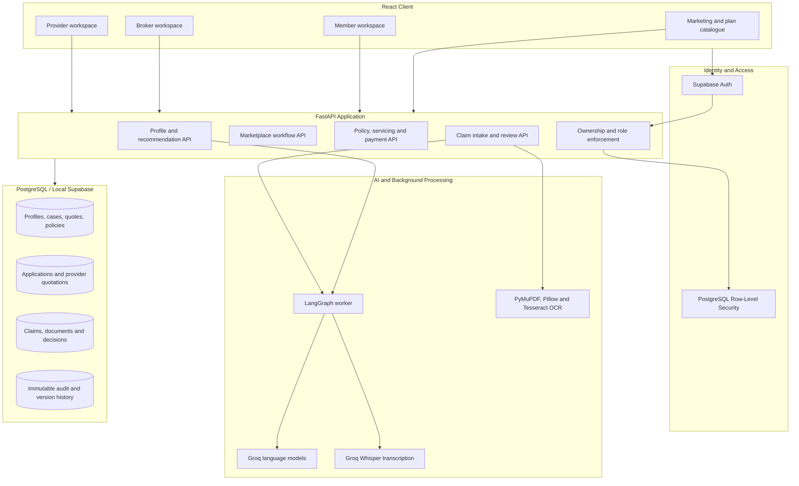

# Helm AI

Helm AI is a complete end-to-end health-insurance product and operational workflow developed for **Helm AI, a real Dubai client**. It connects UAE residents, brokers and insurance providers across discovery, profile intake, personalised plan recommendations, quotation requests, provider responses, policy activation, servicing, payments and claims management.

The repository includes the customer experience, broker workspace, provider workspace, AI assistants, workflow APIs, database security, seeded local accounts, automated tests and local runtime tooling required to demonstrate the complete journey. Local plans, prices, providers, policies, payments and claim records are fictional demonstration data and do not represent live insurance cover.

<div align="center">

[](https://react.dev/)
[](https://www.typescriptlang.org/)
[](https://fastapi.tiangolo.com/)
[](https://www.postgresql.org/)
[](https://supabase.com/)
[](https://groq.com/)
[](https://langchain-ai.github.io/langgraph/)

</div>

## Table of Contents

- [Product Overview](#product-overview)
- [User Workspaces](#user-workspaces)
- [Architecture](#architecture)
- [Complete Marketplace Workflow](#complete-marketplace-workflow)
- [Complete Claims Workflow](#complete-claims-workflow)
- [Features](#features)
- [Technology Stack](#technology-stack)
- [Repository Structure](#repository-structure)
- [Local Requirements](#local-requirements)
- [Quick Start](#quick-start)
- [Manual Setup](#manual-setup)
- [Environment Variables](#environment-variables)
- [Demo Accounts](#demo-accounts)
- [API Surface](#api-surface)
- [Testing](#testing)
- [Security and Data Controls](#security-and-data-controls)
- [Operational Notes](#operational-notes)

## Product Overview

Helm AI provides one connected health-insurance journey for individual UAE customers:

- capture identity, residency, health, funding and cover preferences;
- accept natural-language and voice input through the Helm assistant;
- compare a catalogue of 50 fictional schemes from 10 fictional partners;
- rank plans against saved member requirements using deterministic rules;
- explain recommendations and trade-offs in plain language;
- send selected requests to providers with explicit member consent;
- allow providers to return structured quotations;
- notify members when quotation responses arrive;
- let members compare and select a quotation;
- complete provider acceptance and policy-start checkpoints;
- surface the active policy in member and provider workspaces;
- support policy servicing, payments, reassessment and appeals;
- accept normal or emergency claims with images and PDFs;
- assist claim intake while keeping consequential decisions human-reviewed;
- provide brokers with evidence, documents, flags, reasoning and an audit trail.

## User Workspaces

### Member workspace

Members can:

- maintain a reusable insurance profile;
- speak or type to the Helm assistant;
- receive personalised plan recommendations;
- request and compare provider quotations;
- select a quotation and follow its live status;
- review policy terms, cover, payment schedule and nearby care;
- submit claim descriptions and supporting images/PDFs;
- follow claim status and submit appeals.

### Broker workspace

Brokers can:

- view only assigned member cases;
- review plan recommendations and policy-fit questions;
- see which providers received a member request;
- monitor provider quotation progress;
- complete marketplace checkpoints;
- review normal and emergency claims;
- open or download member claim documents;
- inspect AI-extracted findings, flags and the full claim transcript;
- confirm, edit or reject suggested claim actions;
- review appeals, reassessments and quality samples.

### Provider workspace

Providers can:

- receive applications routed to their organisation;
- review the consented member profile;
- prepare and submit structured quotations;
- accept a member's selected quotation;
- start the resulting policy;
- view active provider policies and payment state;
- discontinue policies or raise operational flags when permitted.

## Architecture



## Complete Marketplace Workflow

1. The member signs in and starts a new shopping case.
2. Profile intake captures identity, residence, health, budget and cover preferences.
3. Required fields are validated and stored in a versioned member profile.
4. Deterministic matching filters and ranks eligible catalogue plans.
5. Helm explains the strongest recommendations using saved facts and database plan terms.
6. The member selects plans/providers and explicitly consents to sharing the required profile.
7. Marketplace applications are created for the selected providers.
8. The broker can see the request, selected providers and progress in the broker workspace.
9. Each provider reviews its assigned request and submits structured quotation terms.
10. Member notifications and the marketplace timeline update as responses arrive.
11. The member opens the returned quotations and selects one quotation.
12. The selected provider receives the member's acceptance request.
13. The provider accepts and confirms policy-start details.
14. Required broker/binding-readiness checkpoints are completed.
15. The marketplace policy is created and appears in the member and provider workspaces.
16. Policy servicing, payment scheduling, cover questions and later claims continue from the same record.

## Complete Claims Workflow

1. The member opens an active policy and selects **Claim Center**.
2. The member describes the event by typing or voice.
3. Supporting bill, invoice, medical image or PDF files can be attached.
4. The API validates file type, size, page count and image limits.
5. Text is extracted from digital PDFs; image/scanned content can use Tesseract OCR.
6. The Claim Agent structures only the facts supplied by the member and asks for missing information.
7. The intake checks policy context, benefit category, possible duplicates, missing evidence and configured rules.
8. Emergency claims are prioritised and can be sent to the on-call route/webhook.
9. Normal and emergency queues are visible in the broker claim workspace.
10. The broker can inspect the original uploaded image/PDF, extracted findings, flags and transcript.
11. AI suggestions remain drafts; a broker confirms or edits consequential actions.
12. Decisions, revisions and evidence are written to an append-only audit trail.
13. The member sees the updated live claim status and can submit an appeal where supported.

## Features

### Discovery and marketplace

- Public homepage, partner catalogue and 50-plan catalogue.
- Responsive animated plan cards and detailed plan pages.
- Three-stage editable profile intake.
- Natural-language profile assistant with conversation state.
- Voice transcription and browser read-aloud.
- Deterministic plan matching with explainable recommendation copy.
- Member consent and provider-specific application routing.
- Provider quotation, member selection and policy-start lifecycle.
- Notification bell and live marketplace status timeline.

### Policy and servicing

- Policy overview and plain-language cover summary.
- Frozen policy terms at selection time.
- Servicing previews and append-only servicing events.
- Benefit-ledger projections.
- Policy reassessment and broker review.
- Member appeals and broker uphold/overturn decisions.
- Nearby-care provider map.
- Simulated monthly/annual payment schedules and receipts.
- Optional Razorpay test-mode adapter.

### Claims

- Free-form and structured claim intake.
- Emergency claim route.
- Voice, image and PDF inputs.
- Private storage and authorised download of original claim evidence.
- OCR and PDF text extraction.
- Claim completeness, duplicate, exclusion and policy-match checks.
- Broker normal/emergency review queues.
- Provisional letters, appeals and claim-quality audits.
- Immutable claim decision and audit history.

### Platform controls

- Supabase email/password authentication.
- Member, broker and provider roles.
- Server-side ownership and organisation checks.
- PostgreSQL Row-Level Security.
- Encryption for sensitive identity values.
- Idempotent command handling.
- Background agent-run leases and retries.
- Responsive and keyboard-accessible interfaces.

## Technology Stack

| Layer | Technology | Usage |
|---|---|---|
| Frontend | React 19, TypeScript 5.9 | Member, broker, provider and marketing interfaces |
| Routing | React Router 7 | Public and authenticated application routes |
| Server state | TanStack React Query 5 | API caching, invalidation, polling and workflow refresh |
| Styling | Tailwind CSS 4 and custom CSS | Responsive layout, cards, forms and animations |
| Maps | Leaflet | Nearby-care provider map |
| Icons/animation | Lucide React, DotLottie | Interface icons and assistant animation |
| API | FastAPI, Uvicorn, Pydantic | Validated REST endpoints and application configuration |
| Database | PostgreSQL 17, SQLAlchemy 2, Psycopg 3 | Transactional workflow state and binary claim evidence |
| Platform | Supabase local stack | Authentication, PostgreSQL, RLS and Studio |
| AI workflow | LangGraph | Durable assistant and claim-agent state |
| Language/STT | Groq, Whisper Large V3 | Assistant responses, extraction and voice transcription |
| Documents | PyMuPDF, Pillow, Tesseract | PDF/image validation, extraction and OCR |
| PDF generation | ReportLab | Quotations, proof documents and provisional letters |
| Security | Cryptography/Fernet | Encryption of selected sensitive profile fields |
| Payments | Local simulator, optional Razorpay test mode | Payment orders, verification and receipts |
| Testing | Pytest, Ruff, Playwright, TypeScript | Backend, browser, lint and build verification |

## Repository Structure

```text
Insurance_UAE/
├── backend/
│   ├── app/                    # FastAPI routes, models, rules, agents and worker
│   ├── scripts/                # Configuration, account bootstrap, seeds and smoke tests
│   ├── tests/                  # Backend automated tests
│   ├── .env.example            # Backend configuration template
│   └── pyproject.toml          # Python dependencies and tooling
├── frontend/
│   ├── src/                    # React application and styles
│   ├── package.json            # Frontend dependencies and scripts
│   └── vite.config.ts          # Vite, Tailwind and API proxy configuration
├── scripts/
│   └── start-prototype.ps1     # One-command Windows prototype launcher
├── supabase/
│   ├── migrations/             # PostgreSQL schema, RLS, constraints and triggers
│   └── config.toml             # Local Supabase configuration
├── tests/e2e/                  # Playwright end-to-end tests
├── package.json                # Root scripts and test dependencies
├── playwright.config.ts        # Browser-test configuration
└── README.md                   # Complete project documentation
```

## Local Requirements

- Windows 10/11
- Docker Desktop with the engine running
- WSL with a Linux distribution
- Node.js 22+
- npm
- Python 3.12 inside WSL
- `uv` inside WSL
- Optional Tesseract OCR for image/scanned-document extraction

## Quick Start

Install root and frontend dependencies once:

```powershell
npm install
npm --prefix frontend install
```

Start Docker Desktop, then from the repository root run:

```powershell
powershell -ExecutionPolicy Bypass -File .\scripts\start-prototype.ps1
```

The launcher starts or verifies:

- local Supabase and PostgreSQL;
- demo user accounts;
- marketplace providers and 50 plans;
- FastAPI on `http://127.0.0.1:8000`;
- the LangGraph worker;
- Vite on `http://127.0.0.1:5174`.

Open:

```text
http://127.0.0.1:5174/login
```

## Manual Setup

### 1. Start Supabase

```powershell
npx supabase start --ignore-health-check
npx supabase db reset --no-seed
```

### 2. Create local configuration

From `backend/`:

```powershell
npx supabase status -o json 2>$null | uv run python scripts/configure_local.py
```

This writes ignored local environment files without printing credentials.

### 3. Install and start the backend

```powershell
cd backend
uv sync --python 3.12
uv run python scripts/bootstrap_demo_accounts.py
uv run python scripts/seed_marketplace_providers.py
uv run uvicorn app.main:app --host 127.0.0.1 --port 8000
```

Start the worker in a second terminal:

```powershell
cd backend
uv run python -m app.worker
```

### 4. Start the frontend

```powershell
npm --prefix frontend run dev -- --host 127.0.0.1 --port 5174
```

## Environment Variables

Copy `backend/.env.example` to `backend/.env` and configure the required local values.

| Variable | Required | Purpose |
|---|---:|---|
| `APP_ENV` | Yes | Runtime environment name |
| `DATABASE_URL` | Yes | SQLAlchemy PostgreSQL connection |
| `SUPABASE_URL` | Yes | Supabase Auth/API base URL |
| `SUPABASE_ANON_KEY` | Yes | Local browser/auth public key |
| `GROQ_API_KEY` | For AI | Groq assistant, extraction and transcription |
| `GROQ_MODEL` | No | Text model; default `openai/gpt-oss-20b` |
| `GROQ_STT_MODEL` | No | Speech model; default `whisper-large-v3` |
| `DOCUMENT_ENCRYPTION_KEY` | Recommended | Fernet key for encrypted identity values |
| `SEND_REAL_EMERGENCY_ALERT` | No | Enables configured emergency integration |
| `PAYMENT_PROVIDER` | No | `simulator` by default or `razorpay` test mode |
| `RAZORPAY_KEY_ID` | Razorpay only | Razorpay test key ID; live keys are rejected |
| `RAZORPAY_KEY_SECRET` | Razorpay only | Razorpay test secret |
| `RAZORPAY_WEBHOOK_SECRET` | Razorpay only | Webhook-signature secret |
| `ALLOWED_ORIGINS` | Yes | Browser origins allowed by CORS |
| `TESSERACT_CMD` | OCR only | Full Windows path to Tesseract when not on `PATH` |

Never commit `backend/.env`, API keys, payment secrets or document-encryption keys.

## Demo Accounts

All accounts below are local test identities using fictional data.

| Workspace | Email | Password |
|---|---|---|
| Member assigned to broker | `member@example` | `password` |
| Regular member | `regular@example` | `password` |
| Broker | `broker@example` | `password` |

Provider accounts are generated by `backend/scripts/seed_marketplace_providers.py`:

| Provider | Email | Password |
|---|---|---|
| Al Noor Takaful | `provider@al-noor-takaful.helm-demo.test` | `HelmDemo2026!AlNoorTakaful` |
| Gulf Shield Insurance | `provider@gulf-shield-insurance.helm-demo.test` | `HelmDemo2026!GulfShieldInsurance` |
| Union Assurance UAE | `provider@union-assurance-uae.helm-demo.test` | `HelmDemo2026!UnionAssuranceUae` |
| Pearl Health Partners | `provider@pearl-health-partners.helm-demo.test` | `HelmDemo2026!PearlHealthPartners` |
| Oasis Care Insurance | `provider@oasis-care-insurance.helm-demo.test` | `HelmDemo2026!OasisCareInsurance` |
| Emirates Wellbeing Takaful | `provider@emirates-wellbeing-takaful.helm-demo.test` | `HelmDemo2026!EmiratesWellbeingTakaful` |
| Falcon Medical Cover | `provider@falcon-medical-cover.helm-demo.test` | `HelmDemo2026!FalconMedicalCover` |
| Horizon Health UAE | `provider@horizon-health-uae.helm-demo.test` | `HelmDemo2026!HorizonHealthUae` |
| Cedar Bay Assurance | `provider@cedar-bay-assurance.helm-demo.test` | `HelmDemo2026!CedarBayAssurance` |

These credentials must never be used for real insurance, payment, customer or provider systems.

## API Surface

The complete OpenAPI schema is available while the API is running at:

```text
http://127.0.0.1:8000/docs
```

Major endpoint groups:

| Group | Representative endpoints | Purpose |
|---|---|---|
| Health/config | `GET /health`, `GET /ready`, `GET /api/config` | Runtime readiness and capability flags |
| Public catalogue | `GET /api/public/marketplace-plans`, `GET /api/public/marketplace-partners` | Marketing plan/provider data |
| Profile | `GET/PATCH /api/me/profile` | Member profile state |
| Assistant | `POST /api/cases/{id}/messages`, `GET /api/runs/{id}` | Stateful Helm conversations |
| Voice/documents | `POST /api/voice/transcriptions`, `POST /api/documents` | Transcription and identity extraction |
| Recommendations | `POST /api/cases/{id}/quotes`, `GET /api/quotes/{id}` | Ranked recommendations and quote PDF |
| Marketplace | `/api/marketplace/*` | Consent, recommendations, quotations, notifications and selection |
| Provider | `/api/provider/*` | Provider applications, quotes, acceptance and policies |
| Broker marketplace | `/api/broker/marketplace/*` | Requests, provider routing and checkpoints |
| Policies | `GET /api/policies/{id}`, `POST /api/policies/{id}/servicing` | Policy details and servicing |
| Claims | `/api/policies/{id}/claim-intakes/*` | Member claim intake, documents, completion and appeal |
| Broker claims | `/api/broker/claims/*` | Claim queue, evidence and human review |
| Payments | `/api/instalments/*`, `/api/payment-orders/*`, `/api/payments/*` | Simulator/test payment workflow |

## Testing

### Backend

```powershell
cd backend
uv run ruff check app scripts tests
uv run pytest -q
```

With Supabase, API and worker running:

```powershell
uv run python scripts/live_smoke.py
```

The smoke test verifies an authenticated member/broker journey through recommendation, approval, policy, claim and sandbox payment operations.

### Frontend

```powershell
npm --prefix frontend run check
npm --prefix frontend run build
```

### Browser workflow tests

```powershell
npx playwright install chromium
npm run test:e2e
```

## Security and Data Controls

- Supabase access tokens are verified by FastAPI before protected operations.
- Roles come from protected authentication metadata rather than member-controlled profile fields.
- Member, broker and provider access is checked against ownership, assignment and organisation.
- PostgreSQL RLS provides a second database-level access boundary.
- Passport and Emirates ID values can be encrypted with Fernet.
- Important commands use idempotency keys to prevent duplicate submissions.
- Profile versions, receipts, servicing history and audit records are append-only or immutable.
- Claim originals are stored privately and served only through authorised backend endpoints.
- Voice audio is sent for transcription only when AI is configured and is not retained.
- Identity-document originals are not used as general application storage.
- AI suggestions do not independently bind cover, take payment or issue final consequential claim decisions.

## Operational Notes

### Local ports

| Service | Address |
|---|---|
| Frontend | `http://127.0.0.1:5174` |
| FastAPI | `http://127.0.0.1:8000` |
| Supabase API/Auth | `http://127.0.0.1:54321` |
| PostgreSQL | `127.0.0.1:54322` |
| Supabase Studio | `http://127.0.0.1:54323` |

### Local backup

With Supabase running:

```powershell
npx supabase db dump --local -f schema-backup.sql
npx supabase db dump --local --data-only -f data-backup.sql
```

Store backups outside Git in a protected location. The CLI public-schema dump does not provide a complete backup of Supabase-managed authentication data.

### Scope

The repository implements the complete Helm AI product workflow for local demonstration and client development. Connecting it to live UAE insurers, production payment accounts, production hosting or regulated customer data requires the relevant commercial integrations, security review, compliance approval and deployment configuration.
