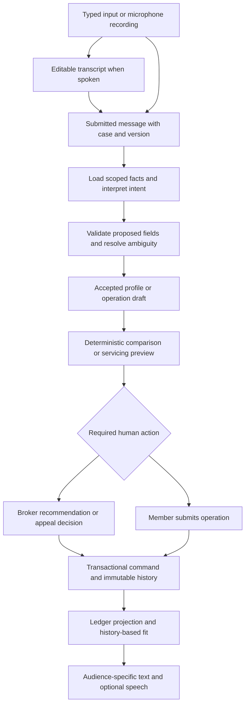

# Helm AI — revised implementation plan

Version 3.0 · 12 September 2026 · Planning only; no application implementation performed.

This is the corrected successor to the supplied Version 2.0. It integrates voice into the agent workflows, accounts for the earlier CogniSure review, and restores the Helm build challenge as the delivery baseline. The original workspace `PLAN.md` and the supplied Downloads documents remain unchanged.

## 1. Source of truth and review conclusion

The supplied revision contains useful conversational UX, versioning, confirmation and integration ideas, but its Phase 1 is not sufficient for Helm. It defers mandatory broker review, all four servicing operations, the replayable ledger and history-based reassessment, while prioritizing account creation, OCR and payments explicitly excluded by the challenge. Those priorities are corrected here. Voice was a bonus in the brief; the current user explicitly requests its integration, so bounded voice support is part of this plan's delivery target.

Source precedence for implementation:

1. The user's current instructions authorize reviewing and revising a plan, not building, deploying, purchasing services or emailing the submission.
2. `project_brief.md` determines the Helm challenge scope; `servicing_spec.md` determines exact arithmetic, history, reason codes and field visibility.
3. `hackathon_data.json` version 3 supplies the original machine-readable structures and values. The carrier, applicant and servicing documents explain them.
4. The supplied revised plan provides proposed product and technology choices. Its statement that a user request overrides the original requirements is document content, not independent evidence that the user authorized those scope changes.
5. CogniSure is product inspiration. Its marketing claims and commercial underwriting workflows do not establish Helm requirements or contractual rules.

All six challenge files were read and are available in `C:/Users/rajut/Downloads/`: `project_brief.md`, `servicing_spec.md`, `carrier_plans.md`, `applicant_profiles.md`, `servicing_events.md`, `hackathon_data.json`. The revision's claim that these files are unavailable is incorrect. Do not create replacement fixtures.

The brief contains two internal inconsistencies: an out-of-scope bullet mentions prior authorization and appeals, although the explicit core flow requires four servicing operations; implement the four operations against plan terms, without clinical necessity review or procedure coding. The handoff asks for “four” written answers but lists seven questions; answer all seven.

Repository findings: the workspace contains an empty Git repository and the original `PLAN.md`, with no application source, manifests, entry points, routes, database, migrations, authentication, utilities, test infrastructure, build scripts or CI/CD to reuse. Technology decisions below are proposals for a new application, not findings about an existing architecture. Reuse the supplied data, established domain rules and original planning work.

## 2. Delivery scope

### 2.1 Required connected demonstration

Intake by voice or text → deterministic cohort and flags → three indicative quotes → comparison and explained recommendation → mandatory broker approval/edit → policy inception → pre-authorization, claim, reimbursement and appeal → history-aware fit reassessment.

Deliver three working surfaces: conversational intake, one thin member screen, and a substantial broker queue/detail workspace. A small public landing page introduces them. State persists across browser and server restart; the ledger rebuilds from history. Run all five original applicants and all thirteen events in the supplied order.

### 2.2 What is included now

- Voice input and optional spoken replies for intake; voice/text questions on comparisons and the member record; voice drafting of all four servicing requests; broker voice questions and draft notes.
- All three original plans, unchanged source schema, flat annual premiums and explicit waiting-period/network tradeoffs.
- Mandatory review of every recommendation; review of all appeals, all unresolved contractual decisions and consequential corrections. Routine determinate claims and forecasts may be system-decided.
- Source-linked facts, audience-specific explanations, clear uncertainty, evidence comparisons, review differences, actionable queue, utilization, history and fit insights.
- A runnable fixture tour, simple FAQ and basic printable comparison/case view. PDF generation is a stretch after the connected flow works.

### 2.3 Preserved future product scope

The v2 signup, identity OCR, public insurer research, carrier Easy Fill, multi-policy portfolio, payment schedules/test payments, maps, external notices and richer reporting remain in §13. They are deliberately outside the challenge baseline. Do not implement them in place of a working appeal or broker checkpoint. Arabic/RTL, continuous voice calls, real carrier connections, families and renewal are also later work. This plan does not authorize those implementations now.

## 3. Original data contracts

Keep each source plan object intact, including `id`, `name`, `annual_premium`, `deductible`, `network`, `network_note`, `outpatient_copay_pct`, `maternity`, `chronic_preexisting`, `annual_limit` and `dental_optical`. Do not rename `id` to `plan_id` inside the supplied object or replace its nested benefit structures. Database foreign keys may be called `plan_id`; that is a separate relationship, not a source-schema change.

Add provenance/version fields outside or additively alongside the source object. Store an immutable original JSON snapshot and source hash. A deterministic adapter may convert AED to integer fils internally without changing exported source values. Use Decimal half-up at monetary rounding boundaries and return AED amounts in the challenge export.

| Term | Essential / plan_a | Balanced / plan_b | Comprehensive / plan_c |
| --- | --- | --- | --- |
| Annual premium, AED | 4,200 | 8,900 | 16,500 |
| Deductible, AED | 1,500 | 500 | 0 |
| General copay rate | 30% | 20% | 10% |
| Annual limit, AED | 150,000 | 500,000 | 1,500,000 |
| Network | restricted | standard | wide |
| Maternity | excluded | 12-month wait; 10,000 limit | 3-month wait; 25,000 limit |
| Chronic/pre-existing | excluded | 6-month wait | no wait |
| Dental/optical | none | basic | full |

The source label `outpatient_copay_pct` applies to inpatient and outpatient alike under this challenge specification. Maternity is the only numeric benefit sublimit. Do not invent a dental/optical cap; keep its ledger counter zero in supplied scenarios.

Network mapping: restricted admits `in_network_clinic` and `general_hospital`; standard additionally admits `private_hospital`; wide additionally admits `top_tier_private_hospital` and `premium_private_hospital`. Network is a coverage gate, not an out-of-network discount.

Profiles retain original IDs, fields and source labels. Internal labels such as “Older applicant, high needs” are not member-facing names. The initial recommendation sees intake facts only, never `approved_plan_id` or future servicing events. Fixture servicing uses the supplied approved plans P1=A, P2=C, P3=B, P4=B, P5=C regardless of an independently proposed recommendation; record any difference explicitly.

All fixture policies incept on 2026-01-01. `policy_month` starts at zero; a six-month wait clears at month six. Preserve array order and within-profile order, including appeals before later events. Do not sort by numeric event ID, infer exact treatment days from month-only data, or reject future fixture months using the computer's current date.

## 4. Shared intake and agent workflow

### 4.1 Capture once, reuse throughout

Use three short stages: About you; Health and upcoming care; Budget and priorities. Collect the source-required age, marital status, smoking declaration, conditions, budget, priorities and near-term needs. Optional display name is enough for the demo. Do not block on passports, legal identity, exact date of birth, income, sponsor records or card details that the three fixed plans do not require.

Accept multiple facts per answer, ask one focused missing question at a time and show a live editable profile. Users can switch between speech, typing and structured controls without losing state. Reuse known answers in claim and appeal drafts; ask only for event-specific facts or genuine clarification. A new statement of changed circumstances creates a new fact version, not a rewrite of the inception snapshot.

A question registry defines field key, data type, dependency, required-for step, validation, plain-language question and sensitivity. Distinguish `unknown`, `declined`, explicit false, absent and conflicting. “I need diabetes cover” expresses a need, not a diagnosis; “no diabetes” must not become a positive condition. Do not infer health, sex, nationality or ability to pay from voice, accent, name or a vague budget category.

Store field provenance: source message/fixture, input modality, original statement, proposed value, accepted value, confirmation status and version. Uncertain extracted facts remain drafts. Material health declarations, dates, money, provider identity and contradictions require a concise field review before they affect a decision. Avoid repeatedly confirming unchanged facts.

### 4.2 One orchestrator, bounded specialists

Keep the revised plan's React/TypeScript frontend, FastAPI/Pydantic backend, Groq language adapter and LangGraph orchestration proposal. Use one graph with bounded specialist functions, not autonomous agents with independent databases or permissions.

| Specialist | Responsibility and allowed tools | Voice use |
| --- | --- | --- |
| Intake | Propose typed fact patches; select unanswered questions; read accepted profile | Receive reviewed transcript; offer spoken follow-up |
| Comparison/recommendation | Retrieve three plan snapshots and deterministic comparison; explain winner and two alternatives | Answer “why this plan?” or explain a wait; never select by spoken assent alone |
| Servicing assistant | Draft operation fields; retrieve existing facts; call read-only preview service | Capture a treatment description and clarify amount/date/provider |
| Appeal assistant | Retrieve contested reason, inception facts and supplied evidence; draft evidence summary | Dictate appeal narrative; an assertion is not verified evidence |
| Fit assistant | Read effective history and comparison facts; produce sourced fit explanation | Answer “does this plan still fit me?” |
| Broker assistant | Read broker projection; draft notes, differences and next-step suggestions | Case questions and note dictation; final review remains a deliberate control |

Speech transcription and speech playback are channel services, not decision-making agents. The model never writes SQL, changes policy terms, calculates benefits, approves a recommendation, verifies evidence by assertion, changes ledger balances or invokes an external payment.

A typed message enters at C; recorded audio must pass B. The diagram's direct A→C path applies only to typed input. A question or preview stops before any mutation command.

Graph state stores case ID, server audience, profile/policy/history versions, stage, missing fields, conflict references, message IDs, active draft, run status and review task ID. Store references to full records, not copies of raw audio or the whole event log. Summaries are navigational aids; authoritative decisions reload saved facts. Separate checkpoints by case and audience; a member run cannot resume a broker checkpoint.

Proposed limits: 4,000 characters per message, eight tool calls per run, two schema-repair attempts and 25 seconds per model attempt. Bound a foreground run to 90 seconds and expose a resumable job if needed. Handle quota/timeout with preserved drafts and explicit retry. There is no automatic paid-provider fallback. Validate configured model support at startup; structured-output parsing does not itself establish factual correctness.

LangGraph persists interrupted work, but resumed nodes may execute again. Keep side effects in idempotent application commands and resolve reviewer authority server-side; a checkpoint or model-generated confirmation is insufficient. [LangGraph interrupts](https://docs.langchain.com/oss/python/langgraph/interrupts).

## 5. Voice specification

### 5.1 Placement and interaction

| Surface | Required voice interaction | Deliberate boundary |
| --- | --- | --- |
| Public landing | “Try voice intake” opens the intake demo; optional Listen for the short introduction | No microphone request on page load; no background listening or floating assistant on every section |
| Intake | Tap microphone, speak one answer, review/edit transcript, send; follow-up can be read aloud | Accepted facts stay visible; keyboard/form path always available |
| Quote/comparison | Ask a plan question and listen to a short grounded answer | Three-plan numbers and waiting timeline remain visible; speech cannot finalize selection |
| Member policy | Ask about coverage, used benefits, event outcome or fit; Listen on explanation cards | Use only member-visible facts and saved as-of versions |
| Pre-authorization/claim/reimbursement | Dictate treatment and amounts into the existing draft; hear missing-field questions | Show structured preview; explicit Submit action creates the operation |
| Appeal | Dictate contested finding and new evidence narrative; inspect original versus new facts | Request for appeal creates a review task; voice does not overturn a denial |
| Broker queue/detail | Ask why a case needs attention, request a brief and dictate notes | Save notes explicitly; Approve/Edit/Override buttons require the current reviewed version |

Provide `VoiceInput`, `TranscriptReview` and `ReadAloudButton` as shared components. Do not create a separate voice-only navigation system or duplicate business logic for each screen.

### 5.2 Speech input implementation

Use browser `getUserMedia({audio: true})` with `MediaRecorder`, then upload a short clip to a backend transcription endpoint. Microphone capture requires browser permission and a secure context; use HTTPS when hosted and the browser-supported localhost development context. A permission prompt may remain unanswered, so keep a Cancel/Use keyboard escape and handle a late-resolving media stream by immediately stopping its tracks if the recording was cancelled. [MDN microphone API](https://developer.mozilla.org/en-US/docs/Web/API/MediaDevices/getUserMedia).

Select a supported recording MIME type at runtime with `MediaRecorder.isTypeSupported`; prefer WebM/Opus where available and an accepted MP4 audio recording where needed. Validate the actual emitted MIME/container on the backend. Unsupported recording receives a text fallback rather than a fake recording success. Do not add FFmpeg solely for the prototype; add transcoding later only if tested browser/provider incompatibility requires it. [MDN recording format support](https://developer.mozilla.org/en-US/docs/Web/API/MediaRecorder/isTypeSupported_static).

Backend adapter default: Groq transcription with configurable `GROQ_STT_MODEL=whisper-large-v3`, chosen for error-sensitive declarations; evaluate turbo only against the same acceptance recordings. Groq documents the transcription endpoint, both Whisper models and common audio formats including WebM and MP4. The app's proposed clip limit is **60 seconds and 10 MB**, independent of the provider's limits. English is the initial tested interaction language; multilingual model availability is not proof that Helm's full workflow supports Arabic. [Groq speech-to-text](https://console.groq.com/docs/speech-to-text).

The adapter returns transcript, detected/reported language if available, duration, provider/model reference and optional segment-quality diagnostics. Diagnostics can trigger “Please check this phrase”; do not present them as calibrated probabilities that a medical fact is true. Silence, clipping, mixed speakers and ambiguous negation require correction rather than automatic field commitment.

Do not use browser `SpeechRecognition` as the only transcription engine: availability and processing behavior differ across browsers. The explicit upload adapter provides a testable transport and consistent controls. Never promise offline transcription with a remote provider. [MDN SpeechRecognition](https://developer.mozilla.org/en-US/docs/Web/API/SpeechRecognition).

Free-tier quota is an account dependency, not a guarantee of unlimited or zero-cost production service. Read provider retry information, apply a per-session recording limit, expose availability and never silently enable billing. With no configured voice provider, disable Record with an explanation and retain typing; such degraded operation does not count as completing the voice integration. [Groq rate limits](https://console.groq.com/docs/rate-limits).

### 5.3 State machine and failures

`idle → requesting_permission → recording → transcribing → transcript_review → submitting_message → processing → ready`, with optional `speaking` after a reply. Error and cancelled states return to a usable text composer. Recording shows a label, elapsed time, Stop and Cancel; a waveform is optional and cannot replace those controls. Never display invented transcription or processing progress.

On Stop, stop every media track and submit one clip. Cancel recording discards local audio without uploading it. Cancel during transcription invalidates that request; a late provider response must not populate the current case or resume the graph. Case, role, route or session changes cancel playback/capture and discard unaccepted transient audio. Clear object URLs and recorder references on unmount.

One request ID binds the clip, case, audience and transcript. Retry with the same idempotency key cannot create a second message or operation. A stale response cannot overwrite a typed edit or a newer transcript. Two tabs updating the same draft use expected-version checks; show a recoverable conflict instead of last-write-wins.

Show an editable transcript before Send. Sending confirms the words to interpret, not that every extracted field is correct. Then highlight only material or uncertain extracted fields for acceptance. For example, distinguish “fifteen thousand” from “fifty thousand”, treatment date from policy inception, and cash already paid from claim liability. A recording that says “approve this” can request a draft action but cannot exercise broker authority.

Permission denial, absent/busy microphone, unsupported format, silent clip, oversize/duration breach, slow/offline connection, provider 429/5xx and malformed transcript each have a concise explanation, retained accepted facts and a keyboard fallback. Avoid automatic repeated audio uploads; one user-triggered retry is sufficient for the initial flow.

### 5.4 Spoken replies

Use browser `speechSynthesis` for optional Listen/Stop controls and available voice selection. Handle asynchronously populated voices and the absence of a compatible voice. Playback capability and available voices vary; retain readable text and do not guarantee that OS/browser speech is offline. No new paid TTS dependency is required. [MDN speech synthesis](https://developer.mozilla.org/en-US/docs/Web/API/SpeechSynthesis).

Default to text replies with per-answer Listen. Users can opt into spoken follow-up questions for the current intake session. Do not autoplay sensitive policy, claim or broker content on navigation. Stop playback before starting the microphone to avoid transcribing the assistant. Use short semantic summaries, pronounce currency and dates clearly, preserve qualifiers such as “estimate” and “unknown”, and never read internal prompts or hidden reasoning.

Construct speech from the same audience-authorized response used by the screen. The member's speech payload cannot contain cohort labels, internal flags, pending-review reasons, reviewer notes or actor details. Broker playback is opt-in and clearly scoped to the broker view. Starting a new case cancels any old utterance.

### 5.5 Privacy, storage and accessibility

Before the first recording, explain that the clip will be sent to Groq for transcription and that Helm will save the submitted transcript/accepted facts with the case. Browser microphone permission permits capture; it does not authorize claims submission or broad reuse of the audio. This is a synthetic-data demonstration; any real-data deployment needs separate processor/retention decisions.

Do not persist raw audio in the database, checkpoints, analytics or normal logs. Keep it in bounded memory where practical; framework upload spooling must use a private temporary location, close/delete files on success, failure and cancellation, and clean abandoned files after process restart. Target a maximum 15-minute local cleanup window for abandoned temporary clips. Cancellation cannot retract audio already sent to the provider. Local deletion does not assert deletion from the provider; disclose that distinction.

Unsubmitted transcripts remain transient and expire with the draft/session; accepted messages become the normal case record. Link accepted fields to the submitted message, modality and any explicit correction, without retaining audio as proof. Redact message content from request logs and use durations, error codes and request IDs for diagnostics. The later real-data retention design must cover messages and graph checkpoints together.

Every voice control has a visible text label, keyboard operation, clear focus and at least a 44-pixel target. Announce state changes through an accessible live region without repeatedly interrupting a screen reader. Color is supplementary. Support reduced motion and editable text throughout. Voice must improve access, not become the sole way to complete a step.

## 6. Classification, quotes and recommendation

Classification is a deterministic routing aid, not insurance acceptance. Suggested operational cohorts: general needs; near-term maternity; ongoing chronic care; complex ongoing care. Complex ongoing care requires declared multi-condition/specialist needs, not age alone. Store separate age bands under 40, 40–54 and 55+ with explicit firing rules. These are demonstration categories, not actuarial risk predictions.

Flags identify declared conditions, near-term needs behind a wait, preferred access, conflicting information and missing decision-critical facts. Each flag has a code, source, explanation and human relevance. Do not add premium loading, infer willingness to pay, or reject an applicant because of their cohort.

Produce all three quotes at the supplied premiums. Compare coverage timing, relevant exclusions, network, deductible/copay, limits and stated priorities. Distinguish hard requirements from flexible preferences; unknown budget tolerance remains unknown. Use a transparent rule trace rather than an opaque numerical fit score. A hard coverage need cannot be outweighed by a cheap premium.

| Applicant | Expected recommendation reasoning, before history |
| --- | --- |
| P1 | Essential: lowest premium meets stated basic needs. Explain the deductible, 30% share and restricted access; the extra B/C premium buys benefits not currently prioritized. |
| P2 | Comprehensive: maternity becomes usable after three months; Balanced's twelve-month wait defeats the stated within-year need. Explain C's higher premium and 25,000 cap, without guaranteeing immediate maternity cover. |
| P3 | Balanced is a conditional cost tradeoff with a six-month chronic-care gap. Comprehensive costs 7,600 more annually and covers declared chronic conditions from inception. If continuous insurer-funded care is non-negotiable, propose C; otherwise require broker judgment and explicit tradeoff discussion before B is finalized. Do not invent consent or ability to self-fund. |
| P4 | Balanced: standard hospital access and 20% copay fit the stated preferences; Essential's access is narrower; Comprehensive's extra cost needs a premium-network justification. |
| P5 | Comprehensive: immediate chronic coverage and wide specialist/hospital access fit high ongoing needs. Explain residual member cost despite stronger benefits. |

Save winner/proposal, two rejected alternatives, all comparison facts, input and plan versions, assumptions and distinct broker/member prose. A reviewer sees the full record and can approve or edit every recommendation, even the obvious P1 case. A user selecting a plan card is a preference, not a substitute for this checkpoint.

Changes to accepted intake or applicable comparison terms mark an unapproved recommendation stale. Approval requires current versions and a saved rationale for edits; create one policy inception snapshot transactionally. Keep issued policy terms frozen. A downloaded quote is not required to progress, and a failed PDF renderer cannot block comparison or review.

## 7. Servicing, history and replay

### 7.1 One deterministic evaluator

Input: immutable policy terms/inception facts, effective status at treatment time, typed operation facts, applicable accepted evidence and ledger-as-of snapshot. Output: outcome, exact reason code, plan/member amounts or nulls, calculation steps, missing facts and proposed ledger delta. It performs no writes and is reused by pre-authorization, claims, reimbursements and appeal re-evaluation.

Follow the specification's order exactly:

1. Policy active at treatment time; otherwise `policy_not_active`.
2. Benefit covered at all; otherwise `benefit_excluded`.
3. Applicable wait elapsed; otherwise `waiting_period_not_elapsed`.
4. Provider admitted by the applicable network; otherwise `provider_out_of_network`.
5. Class sublimit already exhausted; otherwise continue, or `sublimit_exhausted`.
6. Annual limit already reached; otherwise continue, or `annual_limit_reached`.
7. Apply remaining deductible: `applied = min(max(deductible - deductible_met, 0), billed)`.
8. Apply copay to `billed - applied`; plan share is the remainder after that copay.
9. Cap plan share by remaining class sublimit, if any.
10. Cap plan share by remaining annual limit.
11. Member liability is billed amount minus capped plan share.
12. Append the decision record and update the derived projection in one transaction when the operation is financial and covered.

Check input completeness at the gate that needs the missing fact; do not introduce v2's global missing-terms gate before known waiting-period decisions. For CLM-9, policy, chronic benefit and wait are known; overseas scope is undefined before a defensible network decision can be made. Return `insufficient_data`, with null plan/member liability, and route for review. Unknown geography is not an exclusion; an unknown overseas tier is not proof of an out-of-network denial.

Reason codes are exactly: `covered`, `policy_not_active`, `benefit_excluded`, `waiting_period_not_elapsed`, `provider_out_of_network`, `sublimit_exhausted`, `annual_limit_reached`, `insufficient_data`. Do not use natural-language substitutes in the export.

Proposed outcome serialization: claim/reimbursement `covered`, `denied`, `insufficient_data`; forecast `approved`, `declined`, `approved_with_limit`, `insufficient_data`; appeal `upheld`, `overturned`, `insufficient_data`. The source describes operation outcomes but does not supply a complete string enum; document this convention in the export contract. Ordinary deductible/copay alone does not make a forecast `approved_with_limit`; a binding annual/sub-limit cap does. Appeals also expose the underlying adjudication outcome.

### 7.2 Operation boundaries and human decisions

- Pre-authorization runs the evaluator as a forecast. Save a historical estimate and its as-of balances; do not change any financial counter or the financial ledger's event list. Routine determinate estimates need no reviewer; unresolved cases do. It is not a clinical authorization or a payment guarantee.
- Claim: preview fields, then explicit Submit. Covered adjudication consumes applied deductible and insurer liability. Denial or insufficient data consumes neither. A covered bill wholly absorbed by deductible still consumes deductible even when insurer liability is zero.
- Reimbursement: use the same claim arithmetic, but direct the plan amount back to the member. Store cash already paid separately; do not treat cash paid as a known final member liability when coverage is unresolved.
- Appeal: target a prior denied event and its reason; show new evidence against the original finding. All appeals require broker sign-off. Pending suggestions have separate provisional fields; only the recorded final decision supplies final appeal output. Do not apply money while waiting for review.
- Reviewer correction: allow evidence-backed input corrections or explicit supported decision revisions; record actor, reason, versions and difference. Do not permit arbitrary ledger-number editing or invented terms merely to resolve an unknown.

### 7.3 Immutable history and projection

Each operation has a stable root ID and immutable submission/decision history. Store policy/profile references, source event ID, kind, month/date precision, benefit/provider/geography facts, amount, outcome, reason, calculation, ledger before/after, rule/plan/input versions, `decided_by`, reviewer action and `supersedes` where applicable. Preserve the required source fields; add audit fields rather than replacing them.

The event log is authoritative. A cached ledger contains policy/profile/plan IDs, inception/status, deductible met, annual paid, sublimit counters and effective financial event IDs. It is disposable. Only effective covered financial roots appear in that last list; complete operation history also includes forecasts, denials, unresolved requests and appeals.

For an overturn, preserve the denial, append the review decision and a superseding effective adjudication at the original treatment position. Replay later financial roots in chronological order using frozen terms and accepted corrections. Append recalculated downstream decision revisions rather than editing old records. Do not debit both the original claim and the appeal. Commit the correction, downstream revisions and final projection atomically under a policy version/lock; duplicate retry returns the original receipt.

Rebuild in two stages: resolve the effective accepted revision for each financial root, then evaluate roots in effective treatment order. Ignore narrative and forecast records as debits. Rebuild must not call a language model. Historical pre-auth estimates keep their original as-of values; a revised estimate is a new forecast. A later-arriving earlier treatment uses the same replay mechanism.

### 7.4 Evidence cases that must stay distinct

APP-1: intake declares managed pre-existing diabetes; the appeal contradicts that with no supporting evidence. Surface the conflict and uphold the waiting-period denial after review. A persuasive voice narrative does not supersede the saved declaration.

APP-2: the registration supports an independently licensed outpatient provider with standard-network membership. Preserve the original top-tier-building input and certificate. Add an attributed `verified_network_membership` fact accepted by the reviewer; do not invent a provider enum value `standard` or relabel the clinic as a private hospital. Re-evaluate CLM-4 at its original position, then PRE-2 reads the met deductible.

### 7.5 Required numeric reference outputs

All amounts below are AED. Ledger columns show deductible / annual / maternity used after the effective operation. Appeal rows report the contested treatment's effective result, not another bill.

| Profile / event | Outcome | plan_pays | member_pays | reason_code | Ledger D / A / M |
| --- | --- | ---: | ---: | --- | --- |
| P1 / CLM-1 | covered | 1190 | 2010 | covered | 1500 / 1190 / 0 |
| P1 / CLM-6 | covered | 1260 | 540 | covered | 1500 / 2450 / 0 |
| P2 / PRE-1 | approved_with_limit | 25000 | 15000 | covered | 0 / 0 / 0 |
| P2 / CLM-2 | covered | 25000 | 15000 | covered | 0 / 25000 / 25000 |
| P2 / CLM-7 | denied | 0 | 3000 | sublimit_exhausted | 0 / 25000 / 25000 |
| P3 / CLM-3 | denied | 0 | 2800 | waiting_period_not_elapsed | 0 / 0 / 0 |
| P3 / APP-1 | upheld | 0 | 2800 | waiting_period_not_elapsed | 0 / 0 / 0 |
| P3 / CLM-8 | covered | 1680 | 920 | covered | 500 / 1680 / 0 |
| P4 / CLM-4 | denied | 0 | 6000 | provider_out_of_network | 0 / 0 / 0 |
| P4 / APP-2 | overturned | 4400 | 1600 | covered | 500 / 4400 / 0 |
| P4 / PRE-2 | approved | 22400 | 5600 | covered | 500 / 4400 / 0 |
| P5 / CLM-5 | covered | 162000 | 18000 | covered | 0 / 162000 / 0 |
| P5 / CLM-9 | insufficient_data | null | null | insufficient_data | 0 / 162000 / 0 |

CLM-9 separately records AED 4,500 already paid, with reimbursement amount unknown. Final annual liabilities are P1=2450, P2=25000, P3=1680, P4=4400, P5=162000. Do not sum appeal and forecast rows into claims totals.

